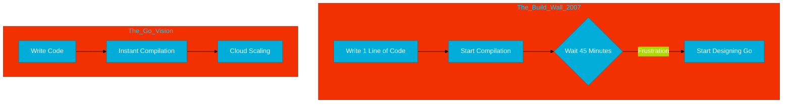

# CH-01: The Google Crisis (The 45-Minute Wait)

> **"Go was born out of frustration, not just ambition."**

---

## 1. Tahap 1: Source Alignments & Judul
- **Source Link**: [Go at Google: Language Design in the Service of Software Engineering](https://go.dev/talks/2012/splash.article)
- **Analogi**: **Lampu Merah Abadi**. Bayangkan Anda ingin pergi ke toko sebelah, tapi setiap kali keluar rumah, Anda harus menunggu lampu merah selama 45 menit. Itulah yang dirasakan engineer Google saat mengompilasi kode C++ mereka. Go adalah solusi "jalan pintas" yang didesain agar Anda bisa sampai ke tujuan dalam hitungan detik.

---

## 2. Tahap 2: Konsep & Esensi (Definisi & Rasionalitas)

### Apa itu Krisis Google?
Pada tahun 2007, infrastruktur Google tumbuh sangat masif. Kode dasar mereka (terutama C++) menjadi terlalu kompleks. Masalah utamanya bukan pada kecepatan eksekusi, tapi pada **Productivity Bottleneck**.

### Why & How?
- **Masalah**: 
    - **Build Times**: Mengompilasi satu binary besar memakan waktu hampir satu jam.
    - **Uncontrolled Dependencies**: Perubahan satu baris kode memicu kompilasi ulang ribuan file yang tidak perlu.
    - **Multi-core Crisis**: Bahasa lama tidak didesain untuk memanfaatkan ribuan core CPU secara efisien tanpa membuat kode menjadi sangat rumit (lock, mutex, dll).
- **Solusi**: Rob Pike, Ken Thompson, dan Robert Griesemer memutuskan untuk berhenti mengeluh dan mulai mendesain bahasa baru di sebuah papan tulis putih.

### Terminologi Teknis
- **Scalability (Software)**: Kemampuan basis kode untuk tumbuh besar tanpa menghambat kecepatan pengembangan.
- **Parallel Compilation**: Teknik di mana compiler dapat memproses banyak bagian kode sekaligus.

---

## 3. Tahap 3: Visualisasi Sistem (The Friction)

---

## 4. Tahap 4: Mekanisme Pembuktian (The Header Problem)

Kenapa C++ begitu lambat? Salah satu alasannya adalah penggunaan `#include`. 
- Dalam C++, jika file A meng-include B, dan B meng-include C, maka compiler akan memproses file C berulang-ulang untuk setiap kali ia ditemukan di pohon dependensi. Ini disebut **Exponential Growth of Input**.
- **Solusi Go**: Go memperkenalkan sistem `import` yang jauh lebih cerdas. Compiler hanya membaca metadata dari paket yang di-import sekali saja. Jika paket tersebut sudah dikompilasi, compiler tidak akan membacanya lagi. Inilah rahasia kenapa kompilasi Go terasa "instan".

---

## 5. Tahap 5: Multi-file Lab Praktis (Examples)

> [!NOTE]
> **Unit ini tidak membutuhkan Lab Praktis karena bersifat penjelasan sejarah krisis Google.**

---
*Status: [x] Complete (Gold Standard)*
