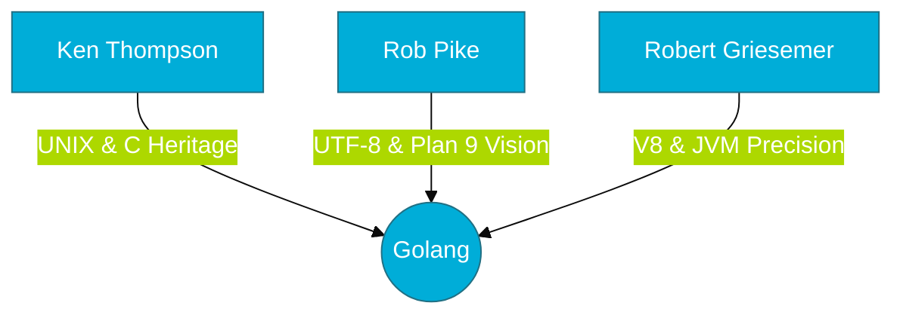

# CH-02: The Founders' Legacy (The Big Three)

> **"Go is C fixed by the people who created C."**

---

## 1. Tahap 1: Source Alignments & Judul
- **Source Link**: [The Go Founders](https://go.dev/doc/faq#Who_created_Go)
- **Analogi**: **Tim Avengers di Dunia Programming**. Ken Thompson adalah Hulk (kekuatan mentah/engine), Rob Pike adalah Captain America (visi/strategi), dan Robert Griesemer adalah Iron Man (presisi/sistem modern). Mereka tidak membuat Go dari nol, mereka membawakan pengalaman kolektif selama 4 dekade ke dalam satu bahasa.

---

## 2. Tahap 2: Konsep & Esensi (Definisi & Rasionalitas)

### Siapa di Balik Go?
Go tidak dibuat oleh komite, tapi oleh tiga orang dengan latar belakang yang sangat kuat di Bell Labs dan Google:

1.  **Ken Thompson**: Pencipta bahasa B (pendahulu C), salah satu pencipta sistem operasi **UNIX**, dan pencipta skema pengkodean **UTF-8**. Ia adalah legenda hidup sistem operasi.
2.  **Rob Pike**: Kontributor utama sistem operasi **Plan 9** dan **Inferno**, serta co-creator UTF-8. Ia sangat vokal mengenai kesederhanaan desain software.
3.  **Robert Griesemer**: Ahli dalam desain mesin virtual (V8 JavaScript Engine, Java HotSpot VM). Ia membawa keahlian optimasi runtime tingkat tinggi ke Go.

### Why & How?
- **Rasionalitas**: Mengapa tim ini begitu penting? Karena mereka tahu persis di mana letak kesalahan desain bahasa-bahasa sebelumnya (C, C++, Java) karena mereka ikut membangun fondasinya. Go adalah upaya mereka untuk memperbaiki kesalahan masa lalu tanpa kehilangan efisiensinya.

---

## 3. Tahap 3: Visualisasi Sistem (The DNA)

---

## 4. Tahap 4: Mekanisme Pembuktian (The Unix Philosophy)

Go sangat dipengaruhi oleh **Filosofi Unix**: *"Do one thing and do it well."*
- **Akar C**: Go mempertahankan syntax yang mirip C namun membuang fitur-fitur yang sering menyebabkan bug (seperti header files, operator overloading, dan pointer arithmetic).
- **Akar Plan 9**: Konsep *Channels* (CSP) di Go sebenarnya adalah evolusi dari eksperimen Pike di sistem operasi Plan 9 dengan bahasa Newsqueak.
- **Akar JVM/V8**: Meskipun Go dikompilasi ke binary asli, ia memiliki Garbage Collector (GC) yang sangat efisien, hasil dari pengalaman Griesemer mengoptimalkan VM paling populer di dunia.

---

## 5. Tahap 5: Multi-file Lab Praktis (Examples)

> [!NOTE]
> **Unit ini tidak membutuhkan Lab Praktis karena bersifat profil pendiri.**

---
*Status: [x] Complete (Gold Standard)*
