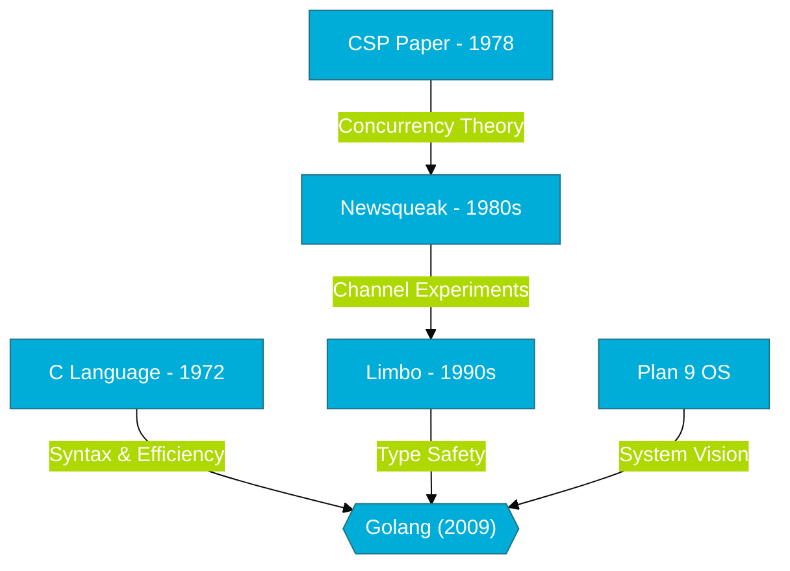

# CH-01: The Technical Bloodline (The Heritage)

> **"Go is not a new language; it is a refined distillation of the best ideas from those who built the foundation of computing."**

---

## 1. Tahap 1: Source Alignments & Judul
- **Source Link**: [Go at Google: Language Design in the Service of Software Engineering](https://go.dev/talks/2012/splash.article)
- **Analogi**: **Restorasi Mobil Klasik**. Jika C adalah mesin orisinal yang kuat namun tanpa fitur keselamatan modern, Go adalah mobil yang sama yang telah direstorasi: mesinnya tetap bertenaga (kecepatan C), namun kini memiliki sistem pengereman otomatis (GC) dan manajemen bahan bakar yang cerdas (Concurrency).

---

## 2. Tahap 2: Konsep & Esensi (Definisi & Rasionalitas)

### Apa itu Silsilah Go?
Go tidak muncul tiba-tiba. Ia adalah hasil dari evolusi pemikiran selama puluhan tahun di Bell Labs. Fokus utamanya adalah mengambil efisiensi bahasa sistem dan menggabungkannya dengan kemudahan bahasa skrip.

### Why & How?
- **Rasionalitas**: Mengapa Go sangat mirip C? Karena Ken Thompson (pencipta C) ingin mempertahankan performa mentah hardware. Mengapa Go punya Channels? Karena Rob Pike sudah menguji coba konsep *Communicating Sequential Processes* (CSP) di bahasa-bahasa eksperimental sebelumnya.
- **Tujuan**: Menghapus "sampah" teknis (seperti header files, inheritance yang rumit, dan manual memory management) agar engineer bisa fokus pada logika bisnis.

### Terminologi Teknis
- **CSP (Communicating Sequential Processes)**: Model matematika untuk konkurensi di mana proses berkomunikasi lewat *Channels*, bukan *Shared Memory*.
- **Distillation**: Proses mengambil bagian terbaik (esensi) dan membuang bagian yang memperlambat.

---

## 3. Tahap 3: Visualisasi Sistem (The Lineage)

---

## 4. Tahap 4: Mekanisme Pembuktian (The Distillation)

Bagaimana Go "menyaring" bahasa pendahulunya?
- **Dari C**: Go mengambil kecepatan eksekusi dan pointer, namun membuang *pointer arithmetic* yang sering menyebabkan *memory corruption*.
- **Dari Newsqueak/Limbo**: Go mengambil konsep `select` dan `chan` (channel) yang memungkinkan ribuan tugas berjalan bersamaan tanpa saling mengunci (*deadlock*) secara manual.
- **Dari Java/Python**: Go mengambil kenyamanan *Garbage Collection*, namun mendesainnya agar memiliki *latency* yang sangat rendah (sub-milidetik), sehingga cocok untuk sistem realtime.

---

## 5. Tahap 5: Multi-file Lab Praktis (Examples)

> [!NOTE]
> **Unit ini tidak membutuhkan Lab Praktis karena fokus pada silsilah dan teori desain bahasa.**

---
*Status: [x] Complete (Gold Standard)*
