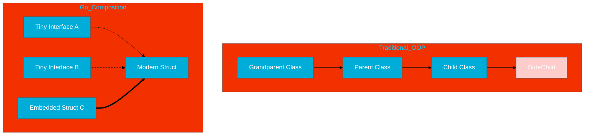

# CH-02: Philosophy (The Scalpel Approach)

> **"Simplicity is the art of hiding complexity, not removing it."**

---

## 1. Tahap 1: Source Alignments & Judul
- **Source Link**: [The Philosophy of Go](https://go.dev/blog/ismore)
- **Analogi**: **Pisau Bedah vs Pisau Lipat Swiss**. C++ sering diibaratkan sebagai pisau lipat yang memiliki segalanya namun berat dan sulit digunakan dengan presisi. Go adalah pisau bedah: hanya memiliki sedikit fitur, namun setiap fitur sangat tajam, ringan, dan didesain untuk satu tujuan spesifik (efisiensi sistem).

---

## 2. Tahap 2: Konsep & Esensi (Definisi & Rasionalitas)

### Apa itu Filosofi Go?
Filosofi Go berpusat pada **Kesederhanaan (Simplicity)** dan **Ortogonalitas**. Go sengaja tidak memasukkan fitur-fitur populer (seperti *class inheritance*, *assertions*, atau *pointer arithmetic*) untuk memastikan kode tetap terbaca meski ditulis oleh tim besar.

### Why & How?
- **Masalah**: Bahasa modern seringkali terlalu kompleks (bloated), membuat debugging dan kolaborasi menjadi mimpi buruk.
- **Solusi**: Memaksimalkan keterbacaan (*readability*). Jika kodenya sedikit, maka kemungkinan bug-nya juga sedikit.

### Terminologi Teknis
- **Orthogonal Design**: Fitur-fitur kecil yang bisa dikombinasikan dengan cara yang dapat diprediksi tanpa harus saling bergantung.
- **Composition over Inheritance**: Menggabungkan objek kecil untuk membentuk objek besar, daripada membuat hierarki kelas yang mendalam.

---

## 3. Tahap 3: Visualisasi Sistem (Complexity)

---

## 4. Tahap 4: Mekanisme Pembuktian (Efficiency)

Go mengandalkan **Static Typing** dan **Structural Typing** (melalui interface). 
- Di balik layar, interface Go diwakili oleh struktur data dua-pointer (`itab` dan `data`). Ini memungkinkan pengecekan tipe saat runtime tanpa memerlukan hierarki kelas yang kaku.
- **Embedding**: Saat satu struct masuk ke dalam struct lain, Go tidak melakukan "inheritance". Ia hanya melakukan delegasi field/method, yang jauh lebih hemat memori dan CPU.

---

## 5. Tahap 5: Multi-file Lab Praktis (Examples)

Untuk memahami filosofi ini secara praktis, kita akan melihat bagaimana Go menggantikan *inheritance* dengan *composition*.

- **Lab 1**: [01_simplicity.go](./examples/01_simplicity.go) - Demonstrasi embedding dan komposisi interface.

---
*Status: [x] Complete (Gold Standard)*
