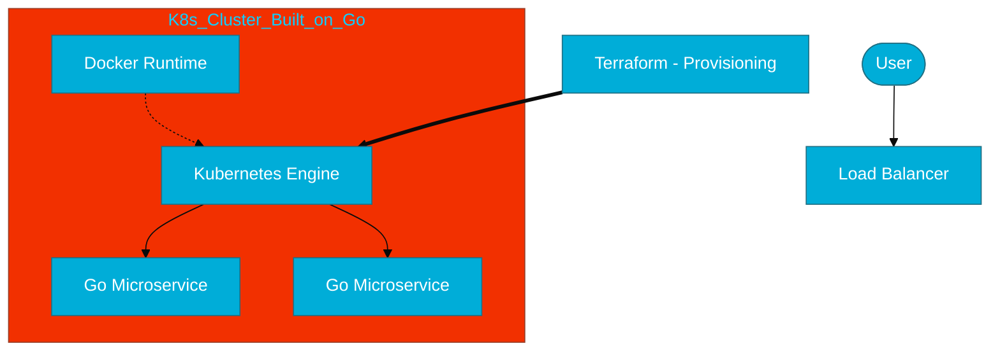

# CH-01: The Go Use Cases (Dominating the Cloud)

> **"Go is the language of cloud infrastructure."**

---

## 1. Tahap 1: Source Alignments & Judul
- **Source Link**: [Case Studies - The Go Programming Language](https://go.dev/solutions/google/)
- **Analogi**: **Bahasa Pemersatu Kontainer**. Jika Internet dibangun di atas C/C++, maka "Cloud" dibangun di atas Go. Ia adalah semen dan baja yang menyatukan seluruh orkestrasi server modern.

---

## 2. Tahap 2: Konsep & Esensi (Definisi & Rasionalitas)

### Kenapa Cloud Native Memilih Go?
*Cloud-native* berarti aplikasi yang didesain untuk berjalan di lingkungan terdistribusi dan dinamis. Go menawarkan tiga hal krusial:
1.  **Static Binary**: Hasil kompilasi Go adalah satu file binary mandiri (tidak butuh JRE atau Node Runtime), sangat ideal untuk Image Docker yang kecil.
2.  **Fast Startup**: Aplikasi cloud sering kali butuh *scaling* (nyala-mati) dengan cepat. Go memiliki waktu *boot* milidetik.
3.  **Efficiency**: Go menggunakan memori jauh lebih sedikit dibandingkan Java namun memiliki performa mendekati C++.

### Terminologi Teknis
- **Statically Linked Binary**: File eksekusi yang menyertakan semua dependensi di dalamnya.
- **Cross-Compilation**: Kemampuan kompilasi Go untuk OS lain (misal: bangun di Windows untuk Linux) hanya dengan satu perintah.

---

## 3. Tahap 3: Visualisasi Sistem (Cloud Context)

---

## 4. Tahap 4: Mekanisme Pembuktian (Binary Portability)

Salah satu alasan teknis terbesar dominasi Go adalah cara ia menangani dependensi.
- Tidak seperti Python yang butuh `pip install` di server, atau Java yang butuh file `.jar` dan JVM.
- Go compiler menghasilkan **Statically Linked Binary**. Saat Anda menjalankan kode Go di server, server tidak perlu tahu tentang Go. Ia hanya menjalankan instruksi mesin mentah. Ini menghilangkan masalah "It works on my machine" di level deployment.

---

## 5. Tahap 5: Multi-file Lab Praktis (Examples)

Meskipun ini naratif, kita bisa membuktikan portabilitas Go dengan mengecek dependensi sistem dari sebuah binary.

- **Lab 1**: [01_binary_check.go](./examples/01_binary_check.go) - Program simpel untuk dikompilasi dan dicek sifat mandirinya.

---
*Status: [x] Complete (Gold Standard)*
