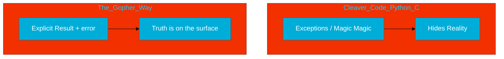

# CH-02: The Gopher Way (Engineering Culture)

> **"Explicit is better than implicit. Simple is better than clever."**

---

## 1. Tahap 1: Source Alignments & Judul
- **Source Link**: [Effective Go](https://go.dev/doc/effective_go)
- **Analogi**: **Aturan Lalu Lintas**. Jika JS atau Python adalah padang rumput di mana Anda bisa lari ke mana saja, maka Go adalah jalan tol dengan marka jalan yang sangat jelas. Anda tidak bisa menyalip sembarangan, namun semua orang sampai ke tujuan dengan aman dan cepat karena aturan yang sama.

---

## 2. Tahap 2: Konsep & Esensi (Definisi & Rasionalitas)

### Apa itu "The Gopher Way"?
Ini adalah sekumpulan nilai budaya yang dianut komunitas Go:
1.  **Readability**: Kode dibaca jauh lebih sering daripada ditulis.
2.  **Explicit Errors**: Go tidak menggunakan *Exceptions*. Setiap error harus ditangani secara eksplisit.
3.  **One Way to Do It**: Go meminimalisir sintaks "ajaib" agar semua orang menulis kode dengan gaya yang sama (`gofmt`).

### Why & How?
- **Masalah**: "Clever Code" (kode sok pintar) sulit dimengerti oleh orang lain saat maintenance.
- **Solusi**: Memaksa penggunaan pola yang monoton namun kuat. Monoton berarti stabil.

### Terminologi Teknis
- **Idiomatic Go**: Menulis kode yang "terasa" seperti gaya asli Go.
- **Ergonomics**: Kenyamanan toolchain Go (testing, linting, formatting sudah satu paket).

---

## 3. Tahap 3: Visualisasi Sistem (Culture)

---

## 4. Tahap 4: Mekanisme Pembuktian (Error Propagation)

Mekanisme penanganan error di Go adalah bukti filosofi eksplisitnya:
- Di Java/JS, Anda menggunakan `try-catch`. Jika ada error di tengah, alur program melompat ke tempat lain (tidak terduga).
- Di Go, fungsi mengembalikan dua nilai: `(result, error)`. Anda **dipaksa** untuk mengecek `if err != nil`. Ini memastikan alur eksekusi tetap linear dan mudah ditelusuri per baris.

---

## 5. Tahap 5: Multi-file Lab Praktis (Examples)

Melihat bagaimana penanganan error eksplisit menjaga program tetap stabil.

- **Lab 1**: [01_error_handling.go](./examples/01_error_handling.go) - Perbandingan polanya.

---
*Status: [x] Complete (Gold Standard)*
