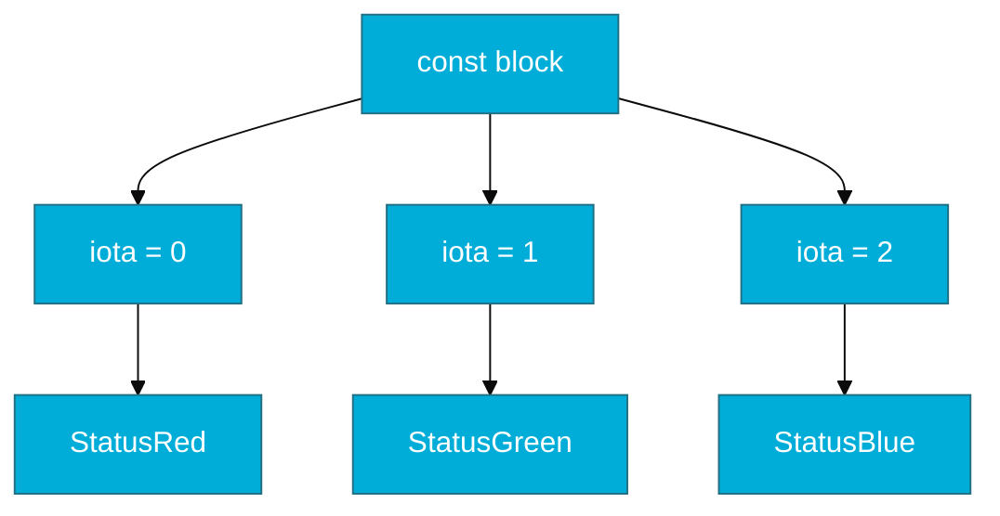

# CH-02: Constants (The Immutable Truth)

> **"Constants in Go are not just variables that don't change; they are part of the type system's logic."**

---

## 1. Tahap 1: Source Alignments & Judul
- **Source Link**: [Go Spec: Constants](https://go.dev/ref/spec#Constants)

---

## 2. Tahap 2: Konsep & Esensi

### Definisi ("Apa itu?")
Konstanta adalah nilai tetap yang ditentukan pada waktu kompilasi (*compile-time*) dan tidak dapat diubah selama program berjalan. Di Go, konstanta bisa bertipe (*typed*) maupun tidak bertipe (*untyped*).

### Rasionalitas ("Why & How?")
- **Performance**: Karena nilainya sudah diketahui saat kompilasi, compiler bisa melakukan optimasi seperti *inlining* (langsung menaruh nilai di tempat pemanggilan) tanpa perlu lookup memori saat runtime.
- **Precision**: Konstanta di Go memiliki presisi yang sangat tinggi (bisa lebih dari 256 bit), memungkinkan kalkulasi numerik yang sangat akurat sebelum dibatasi oleh tipe data variabel.

### Analogi Model Mental
**Ukuran Sepatu Standar**. Sekali ukuran standar "42" ditentukan oleh pabrik (kompilasi), ia tidak akan pernah berubah. Anda bisa menyontek ukuran tersebut ke banyak sepatu (variabel) di toko, namun spesifikasi standarnya tetaplah konstan dan abadi.

### Terminologi Teknis
- **Literal Substitution**: Proses di mana compiler mengganti nama konstanta dengan nilai aslinya secara langsung.
- **Untyped Constant**: Konstanta fleksibel yang belum memiliki tipe data kaku sampai ia benar-benar digunakan.

---

## 3. Tahap 3: Visualisasi Sistem

### High-Level Model (Mermaid)

---

## 4. Tahap 4: Mekanisme Pembuktian (Compile-time Replacement)

Apa yang terjadi pada konstanta saat dikompilasi?
- **No Address**: Konstanta sederhana di Go seringkali tidak memiliki alamat memori (`&x` akan gagal). Nilainya langsung disisipkan ke dalam instruksi mesin CPU.
- **Constant Folding**: Go compiler melakukan kalkulasi matematika konstanta (e.g., `const X = 2 * 10`) saat kompilasi, sehingga saat aplikasi berjalan, CPU hanya melihat angka `20` tanpa perlu melakukan operasi perkalian lagi.

---

## 5. Tahap 5: Multi-file Lab Praktis (Examples)

Melihat kekuatan `iota` dasar dan fleksibilitas *untyped constants*.

- **Lab 1**: [01_iota_power.go](./examples/01_iota_power.go) - Menggunakan iota untuk pembuatan urutan otomatis.

---
*Status: [x] Complete (Gold Standard - PPM V4)*
