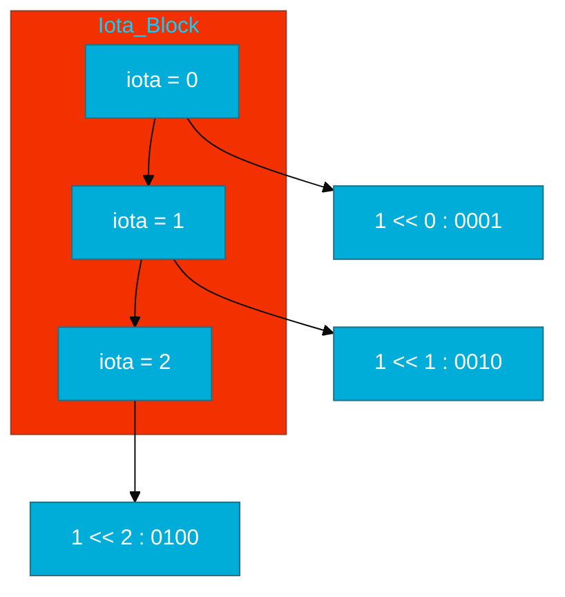
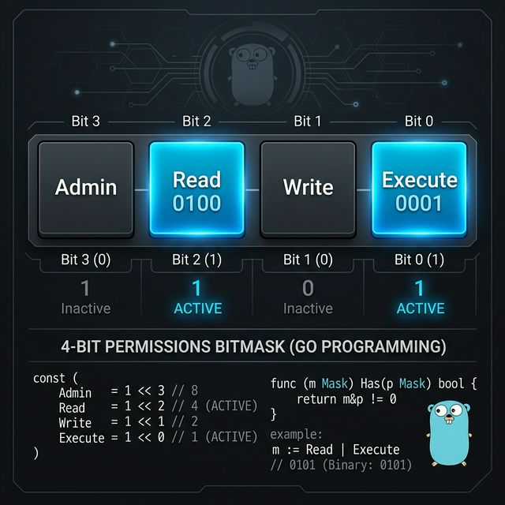

# CH-03: Iota In Depth (The Sequence Generator)

> **"Iota is the powerhouse of Go constants, turning simple sequences into complex systems."**

---

## 1. Tahap 1: Source Alignments & Judul
- **Source Link**: [Go Spec: Iota](https://go.dev/ref/spec#Iota)

---

## 2. Tahap 2: Concept & Essence

### Definisi ("Apa itu?")
`iota` adalah *predeclared identifier* khusus di Go yang mewakili angka integer berurutan. Ia digunakan secara eksklusif di dalam blok `const`.

### Rasionalitas ("Why & How?")
- **Automated Enumeration**: Menghapus kebutuhan untuk menulis angka manual (0, 1, 2...) yang rentan kesalahan saat ada penambahan status baru di tengah urutan.
- **Complex Pattern Generation**: Iota bisa dipadukan dengan operasi aritmatika dan bitwise untuk menciptakan skema penomoran yang kompleks (seperti kelipatan 1024 untuk unit memori).

### Analogi Model Mental
**Tangga Otomatis (Escalator)**. Iota adalah mesin penggerak anak tangga. Setiap kali Anda mendeklarasikan baris konstanta baru dalam satu blok, mesin ini secara otomatis menaikkan index-nya satu langkah.

### Terminologi Teknis
- **Successive Untyped Integer**: Sifat asli iota sebagai angka bulat yang terus bertambah.
- **Bitmasking**: Teknik menggunakan bit (0/1) untuk menyimpan beberapa status dalam satu variabel.

---

## 3. Tahap 3: Visualisasi Sistem

### High-Level Model (Mermaid)

### Physical Representation (Premium Asset)

---

## 4. Tahap 4: Mekanisme Pembuktian (Expression Evaluation)

Bagaimana `iota` dievaluasi oleh Compiler?
- **Block Scope**: `iota` di-reset menjadi 0 di setiap awal kata kunci `const`.
- **Detail Teknis**: Jika Anda mengulang sebuah ekspresi tanpa menulis ulang kodenya, Go akan menggunakan "copy-paste" ekspresi sebelumnya tapi dengan nilai `iota` yang baru. Ini memungkinkan definisi yang sangat efisien untuk pola biner seperti (1, 2, 4, 8, 16...).

---

## 5. Tahap 5: Multi-file Lab Praktis (Examples)

Mempraktikkan penggunaan iota tingkat lanjut untuk sistem nyata.

- **Lab 1**: [01_byte_units.go](./examples/01_byte_units.go) - Skala ukuran memori (KB, MB, GB).
- **Lab 2**: [02_bitmask_auth.go](./examples/02_bitmask_auth.go) - Sistem perizinan dengan bitmask.

---
*Status: [x] Complete (Gold Standard - PPM V4)*
