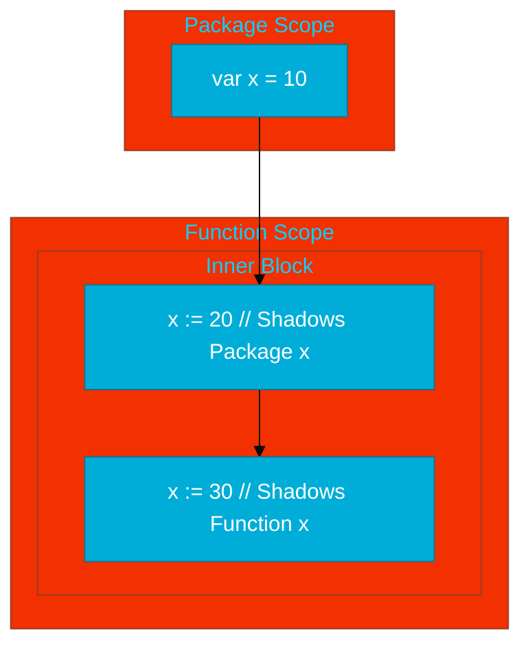

# CH-04: Scope and Shadowing (The Visibility Traps)

> **"Variable shadowing is one of the most common sources of subtle bugs in Go applications."**

---

## 1. Tahap 1: Source Alignments & Judul
- **Source Link**: [Go Spec: Declarations and Scope](https://go.dev/ref/spec#Declarations_and_scope)

---

## 2. Tahap 2: Konsep & Esensi

### Definisi ("Apa itu?")
**Scope** adalah batasan wilayah di mana sebuah nama (variabel/konstanta) dapat diidentifikasi. **Shadowing** terjadi ketika sebuah nama baru dideklarasikan di dalam blok yang lebih sempit, sehingga "menutupi" akses ke nama yang sama di blok yang lebih luas.

### Rasionalitas ("Why & How?")
- **Encapsulation**: Scope memastikan bahwa variabel internal sebuah fungsi tidak bocor ke luar, menjaga kebersihan *global namespace*.
- **The Shadow Trap**: Masalah sering muncul karena operator deklarasi singkat `:=`. Jika digunakan di dalam blok `if` atau `for`, ia menciptakan variabel baru alih-alih mengupdate variabel yang sudah ada, yang seringkali menyebabkan bug logika yang sulit dideteksi.

### Analogi Model Mental
**Efek Payung**. Jika Anda memegang payung (variabel dalam) di bawah atap sebuah rumah (variabel luar), pandangan Anda ke atas hanya akan melihat payung Anda sendiri. Anda tahu atap itu ada, tapi payung Anda "membayangi" (shadows) atap tersebut dari perspektif Anda saat itu.

### Terminologi Teknis
- **Lexical Block**: Struktur kode yang dibatasi oleh kurung kurawal `{}` atau file/package.
- **Universe Block**: Lingkup paling luas di Go yang berisi tipe dasar seperti `int` atau `float64`.

---

## 3. Tahap 3: Visualisasi Sistem

### High-Level Model (Mermaid)

---

## 4. Tahap 4: Mekanisme Pembuktian (Resolution Order)

Bagaimana Go compiler mencari nama variabel?
- **Bottom-Up Search**: Saat compiler menemukan sebuah nama, ia akan mencari di blok terdekat terlebih dahulu. Jika tidak ada, ia naik satu tingkat ke blok di atasnya, terus hingga mencapai *Universe Block*.
- **Static Resolution**: Pencarian ini dilakukan sepenuhnya saat kompilasi. Jika ditemukan nama yang sama di blok dalam, pencarian berhenti dan variabel luar "tidak terlihat" lagi bagi sisa kode di dalam blok tersebut.

---

## 5. Tahap 5: Multi-file Lab Praktis (Examples)

Melihat jebakan shadowing secara nyata dan cara memperbaikinya.

- **Lab 1**: [01_shadow_trap.go](./examples/01_shadow_trap.go) - Demonstrasi bug shadowing dan solusinya.

---
*Status: [x] Complete (Gold Standard - PPM V4)*
