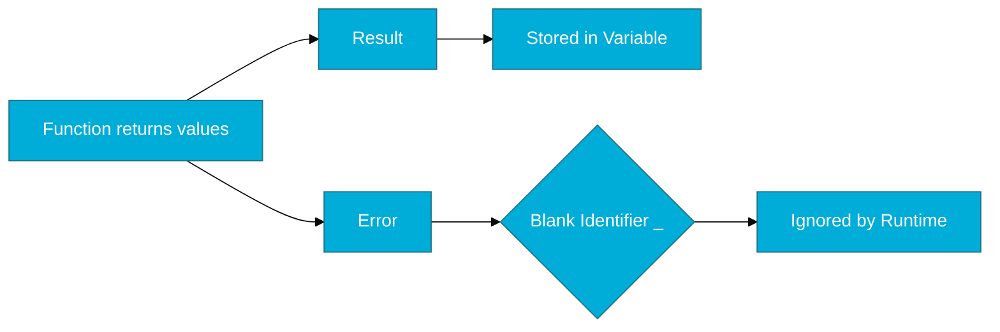

# CH-06: Blank Identifier (The Ultimate Shredder)

> **"Explicitly ignoring a value is better than implicitly ignoring it."**

---

## 1. Tahap 1: Source Alignments & Judul
- **Source Link**: [Go Spec: Blank Identifier](https://go.dev/ref/spec#Blank_identifier)

---

## 2. Tahap 2: Konsep & Esensi

### Definisi ("Apa itu?")
**Blank Identifier** (`_`) adalah pengenal khusus yang bertindak sebagai variabel satu-arah (*write-only*). Ia dapat menerima nilai apa pun dari tipe apa pun, namun nilai tersebut tidak pernah bisa dibaca kembali.

### Rasionalitas ("Why & How?")
- **Compulsory Use Requirement**: Go melarang adanya variabel yang dideklarasikan tapi tidak digunakan. `_` memberikan cara yang bersih untuk membuang nilai balik fungsi yang tidak kita perlukan tanpa melanggar aturan compiler.
- **Side-Effect Imports**: Memungkinkan pemuatan paket (misalnya driver database) hanya untuk memicu fungsi `init()` di dalamnya tanpa menggunakan API paket tersebut secara langsung.

### Analogi Model Mental
**Mesin Penghancur Kertas**. Terkadang Anda mendapatkan dokumen yang tidak Anda butuhkan (nilai balik). Alih-alih menyimpannya di atas meja yang sempit (variabel), Anda langsung memasukkannya ke mesin penghancur (`_`). Meja Anda tetap bersih, dan Anda tidak perlu repot mengelolanya lagi.

### Terminologi Teknis
- **Discard Value**: Tindakan sengaja mengabaikan data hasil operasi.
- **Write-Only Identifier**: Properti unik `_` yang dilarang muncul di sisi kanan persamaan (tidak bisa dibaca).

---

## 3. Tahap 3: Visualisasi Sistem

### High-Level Model (Mermaid)

---

## 4. Tahap 4: Mekanisme Pembuktian (No-Op Allocation)

Bagaimana Go menangani `_` di level memori?
- **Zero Allocation**: Berbeda dari variabel biasa, `_` tidak memakan ruang di *Stack* maupun *Heap*. Go compiler cukup pintar untuk mengetahui bahwa nilai tersebut tidak akan dibaca, sehingga ia seringkali menghapus instruksi mesin untuk memindahkan data tersebut ke register.
- **Runtime Optimization**: Penggunaan `_` membantu pengumpulan sampah (*Garbage Collection*) menjadi lebih ringan karena objek yang dibuang ke sana bisa segera diklaim kembali memorinya jika memungkinan.

---

## 5. Tahap 5: Multi-file Lab Praktis (Examples)

Melihat berbagai kegunaan praktis dari blank identifier.

- **Lab 1**: [01_blank_usage.go](./examples/01_blank_usage.go) - Membuang nilai balik dan loop tanpa index.

---
*Status: [x] Complete (Gold Standard - PPM V4)*
