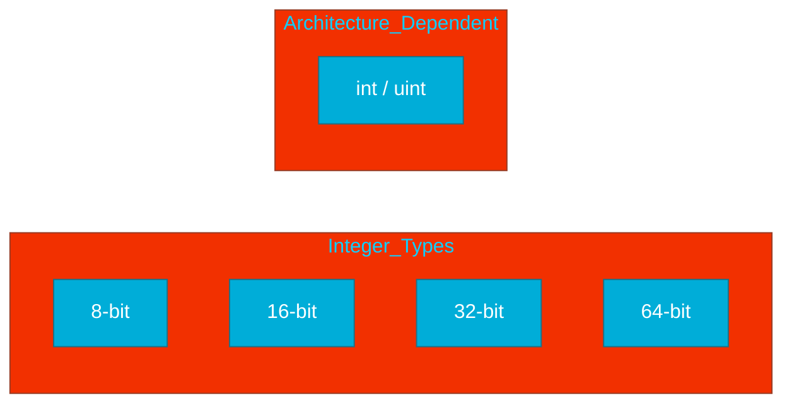
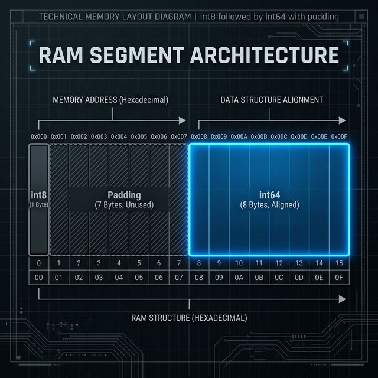

# CH-01: Numeric Types (The Digital Blueprint)

> **"A type is a category of values and the operations that can be performed on them."**

---

## 1. Tahap 1: Source Alignments & Judul
- **Source Link**: [Go Spec: Numeric Types](https://go.dev/ref/spec#Numeric_types)

---

## 2. Tahap 2: Konsep & Esensi

### Definisi ("Apa itu?")
Tipe numerik di Go adalah sekumpulan tipe data untuk merepresentasikan angka bulat (*integers*), angka pecahan (*floating-point*), dan angka kompleks. Go memisahkan tipe data berdasarkan lebar bitnya untuk efisiensi hardware.

### Rasionalitas ("Why & How?")
- **Architectural Optimization**: Tipe `int` dan `uint` menyesuaikan ukurannya dengan arsitektur CPU (32 atau 64 bit) agar operasi aritmatika berjalan pada kecepatan maksimal hardware.
- **Predictable Memory**: Dengan tipe spesifik seperti `int8` atau `int64`, engineer bisa memprediksi dengan tepat berapa banyak memori yang akan digunakan oleh aplikasi *cloud-native* berskala besar.

### Analogi Model Mental
**Dimensi Baut**. Dalam engineering, Anda tidak bisa menggunakan baut ukuran 10mm untuk lubang 8mm. Demikian pula di Go, sebuah `int64` memiliki "lebar" bit yang berbeda dengan `int32`. Memilih tipe data adalah tentang presisi dan efisiensi ruang di dalam "mesin" (RAM).

### Terminologi Teknis
- **Bit Width**: Jumlah bit yang digunakan untuk menyimpan nilai (e.g., int8 = 8 bit).
- **IEEE-754**: Standar internasional yang digunakan Go untuk kalkulasi *floating-point*.

---

## 3. Tahap 3: Visualisasi Sistem

### High-Level Model (Mermaid)

### Physical Representation (Premium Asset)

---

## 4. Tahap 4: Mekanisme Pembuktian (Memory Alignment)

Bagaimana Go menyimpan data di level fisik?
- **Memory Padding**: CPU modern membaca data dalam blok (kata mesin). Jika Anda menempatkan variabel 1-byte diikuti 8-byte, Go akan menyisipkan "padding" kosong agar variabel 8-byte mulai di alamat yang selaras dengan kecepatan CPU.
- **Detail Teknis**: Membaca data yang "pincang" di antara alamat memori membutuhkan dua kali siklus jam CPU. Go memilih performa di atas penghematan byte yang tidak berarti, inilah rahasia kecepatan sistem yang ditulis dengan Go.

---

## 5. Tahap 5: Multi-file Lab Praktis (Examples)

Mengecek ukuran memori setiap tipe data secara nyata pada mesin Anda.

- **Lab 1**: [01_type_size.go](./examples/01_type_size.go) - Menggunakan `unsafe.Sizeof` untuk melihat lebar bit asli.

---
*Status: [x] Complete (Gold Standard - PPM V4)*
