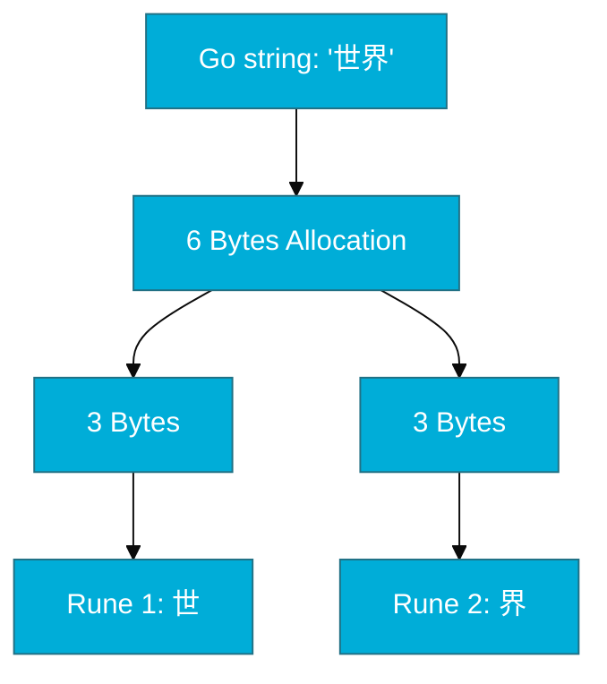
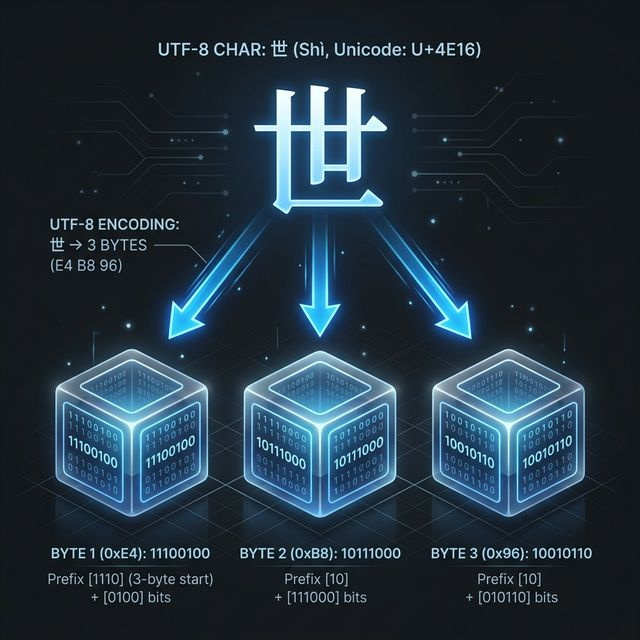

# CH-02: String, Rune, and Byte (The UTF-8 Core)

> **"In Go, a string is a read-only slice of bytes, but we experience it as a sequence of runes."**

---

## 1. Tahap 1: Source Alignments & Judul
- **Source Link**: [Strings, bytes, runes and characters in Go](https://go.dev/blog/strings)

---

## 2. Tahap 2: Konsep & Esensi

### Definisi ("Apa itu?")
Sebuah `string` di Go adalah sekumpulan byte yang bersifat **immutable** (tidak dapat diubah). `Rune` adalah alias untuk `int32` yang mewakili satu titik kode Unicode (*code point*). `Byte` adalah alias untuk `uint8` yang mewakili data mentah 8-bit.

### Rasionalitas ("Why & How?")
- **Default UTF-8**: Go didesain sejak awal untuk mendukung standar web modern. Dengan memperlakukan string sebagai UTF-8, Go bisa menangani teks internasional (termasuk emoji) dengan mulus.
- **Immutability for Concurrency**: Karena string tidak bisa diubah setelah dibuat, ia sangat aman untuk dibagikan antar goroutine tanpa risiko "data race" atau perubahan mendadak di memori.

### Analogi Model Mental
**Buku versus Halaman versus Karakter**. Sebuah `string` adalah selembar kertas biner (byte). `Rune` adalah karakter yang tercetak di atasnya. Kadang satu karakter kompleks (seperti emoji 🔥) butuh 4 lembar kertas (4 byte), sementara karakter sederhana (seperti 'A') hanya butuh 1 lembar.

### Terminologi Teknis
- **UTF-8 Encoding**: Cara mengubah angka Unicode menjadi urutan byte yang efisien.
- **Code Point**: Angka unik yang diberikan oleh konsorsium Unicode untuk setiap karakter di dunia.

---

## 3. Tahap 3: Visualisasi Sistem

### High-Level Model (Mermaid)

### Physical Representation (Premium Asset)

---

## 4. Tahap 4: Mekanisme Pembuktian (String Header)

Apa yang sebenarnya terjadi di dalam RAM saat kita menyimpan string?
- **String Header (Reflect.StringHeader)**: Variabel string sebenarnya adalah struktur data kecil yang berisi dua hal:
    1.  **Pointer**: Alamat memori ke array byte mentah.
    2.  **Len**: Panjang byte tersebut.
- **Detail Teknis**: Karena string hanya menyimpan pointer dan panjang, melakukan *slicing* (`s[0:5]`) sangat efisien karena tidak menyalin datanya. Namun, Go melarang memodifikasi byte tersebut secara langsung (`s[0] = 'a'`) untuk menjamin integritas data sistem.

---

## 5. Tahap 5: Multi-file Lab Praktis (Examples)

Melihat perbedaan nyata antara panjang byte dan jumlah karakter Unicode.

- **Lab 1**: [01_string_internals.go](./examples/01_string_internals.go) - Eksperimen len(byte) vs len(rune).

---
*Status: [x] Complete (Gold Standard - PPM V4)*
