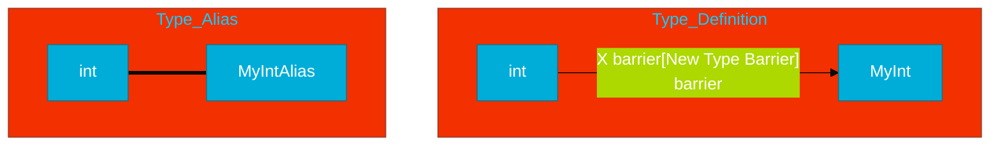

# CH-03: Type Defs and Aliases (The Shape of Logic)

> **"A type definition creates a new type; a type alias creates a new name for an existing type."**

---

## 1. Tahap 1: Source Alignments & Judul
- **Source Link**: [Go Spec: Type Definitions](https://go.dev/ref/spec#Type_definitions)

---

## 2. Tahap 2: Konsep & Esensi

### Definisi ("Apa itu?")
**Type Definition** (`type New int`) menciptakan tipe data baru yang berbeda secara struktur dari tipe aslinya. **Type Alias** (`type New = int`) hanyalah sinonim atau nama lain untuk tipe yang sudah ada.

### Rasionalitas ("Why & How?")
- **Domain-Driven Design (DDD)**: Dengan mendefinisikan tipe baru (e.g., `type UserID string`), kita mencegah kesalahan logika di mana "ID User" dikirim ke fungsi yang meminta "ID Order" meskipun keduanya sama-sama string.
- **Method Attachment**: Go hanya mengizinkan kita menempelkan *methods* pada tipe yang dideklarasikan secara lokal dalam paket tersebut. Type Definition adalah pintu masuk ke pemrograman berorientasi objek di Go.

### Analogi Model Mental
**Kloning vs Nama Panggilan**. `Type Definition` adalah proses kloning: Anda menciptakan entitas baru yang mirip (e.g., Kloning Domba), tapi si klon memiliki identitas yang terpisah. `Type Alias` adalah nama panggilan: memanggil "Si Putih" untuk Domba yang sama. Keduanya menunjuk ke entitas fisik yang identik.

### Terminologi Teknis
- **Underlying Type**: Tipe dasar (seperti `int64`) yang mendasari tipe baru buatan kita.
- **Distinct Type**: Sifat tipe data yang dianggap berbeda oleh compiler sehingga butuh konversi eksplisit.

---

## 3. Tahap 3: Visualisasi Sistem

### High-Level Model (Mermaid)

---

## 4. Tahap 4: Mekanisme Pembuktian (Type System Enforcement)

Bagaimana Go memisahkan tipe-tipe ini?
- **Static Checking**: Compiler Go mencatat "Nama Tipe" untuk setiap variabel. Saat melakukan operasi, ia membandingkan nama ini, bukan tipe dasarnya.
- **Detail Teknis**: Jika Anda memiliki `type Dollar int` dan `type Rupiah int`, compiler akan melarang operasi `Dollar + Rupiah` tanpa konversi eksplisit. Ini memastikan integritas finansial aplikasi Anda terjaga di level kode mesin.

---

## 5. Tahap 5: Multi-file Lab Praktis (Examples)

Melihat perbedaan perilaku antara definition dan alias.

- **Lab 1**: [01_type_behavior.go](./examples/01_type_behavior.go) - Eksperimen konversi dan attachment method.

---
*Status: [x] Complete (Gold Standard - PPM V4)*
