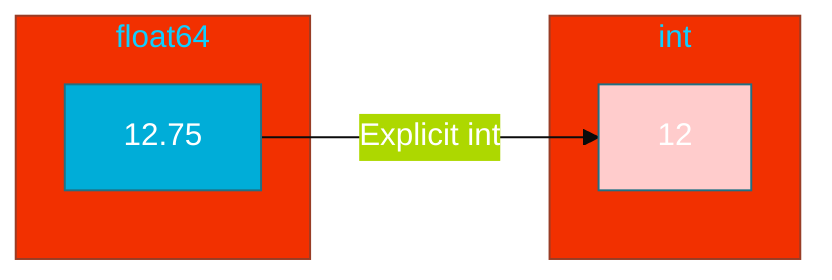

# CH-04: Type Conversion (The Explicit Choice)

> **"If you want to mix types in Go, you must be explicit about it."**

---

## 1. Tahap 1: Source Alignments & Judul
- **Source Link**: [Go Spec: Conversions](https://go.dev/ref/spec#Conversions)

---

## 2. Tahap 2: Konsep & Esensi

### Definisi ("Apa itu?")
Konversi tipe adalah proses mengubah nilai dari satu tipe data ke tipe data lain secara sengaja menggunakan sintaks `T(v)`, di mana `T` adalah tipe tujuan dan `v` adalah nilai.

### Rasionalitas ("Why & How?")
- **No Implicit Conversion**: Go melarang konversi otomatis (seperti `5 + 1.2` di JS) untuk mencegah bug tersembunyi seperti kehilangan presisi numerik atau pembulatan yang tidak terduga.
- **Safety**: Engineer dipaksa untuk mempertimbangkan apakah konversi tersebut aman (e.g., mengubah `int64` besar ke `int8` kecil dapat menyebabkan hilangnya data).

### Analogi Model Mental
**Adaptor Stopkontak**. Anda tidak bisa memasang steker gepeng ke lubang bulat tanpa adaptor. Adaptor tersebut adalah "konversi eksplisit". Ini menjamin Anda sadar bahwa koneksi listrik tersebut telah diadaptasi.

### Terminologi Teknis
- **Explicit Casting**: Pengubahan tipe data yang ditulis secara sadar oleh koder.
- **Precision Loss**: Risiko kehilangan koma atau bit saat berpindah antar tipe.

---

## 3. Tahap 3: Visualisasi Sistem

### High-Level Model (Mermaid)

---

## 4. Tahap 4: Mekanisme Pembuktian (Truncation & Overflow)

Apa yang dilakukan hardware saat kita melakukan konversi?
- **Truncation**: Saat mengubah `float` ke `int`, Go tidak membulatkan, ia memotong (*shredding*) semua bit di belakang koma.
- **Overflow**: Jika angka yang dikonversi lebih besar dari kapasitas tipe tujuan, bit yang meluap akan dibuang, sering kali menghasilkan angka negatif atau angka acak lainnya.
- **Detail Teknis**: Konversi tipe numerik di Go adalah operasi tingkat rendah yang sangat cepat karena seringkali hanya berupa instruksi tunggal di level CPU (misal: `CVTTSD2SI` di x64).

---

## 5. Tahap 5: Multi-file Lab Praktis (Examples)

Mempraktikkan konversi yang aman dan melihat efek pemotongan data.

- **Lab 1**: [01_conversion_safe.go](./examples/01_conversion_safe.go) - Eksperimen konversi antar tipe numerik.

---
*Status: [x] Complete (Gold Standard - PPM V4)*
