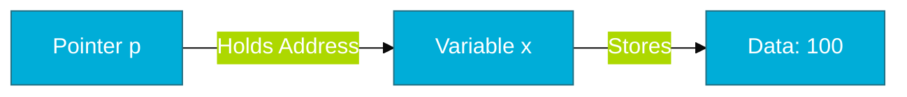
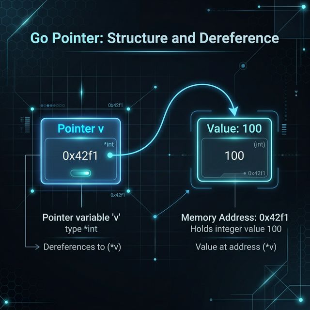

# CH-05: Pointers Intro (The Address of Data)

> **"Pointers in Go are about performance and shared state, without the danger of pointer arithmetic."**

---

## 1. Tahap 1: Source Alignments & Judul
- **Source Link**: [Go Spec: Pointer Types](https://go.dev/ref/spec#Pointer_types)

---

## 2. Tahap 2: Konsep & Esensi

### Definisi ("Apa itu?")
**Pointer** adalah variabel yang menyimpan alamat memori dari nilai lain. Di Go, kita menggunakan operator `&` untuk mengambil alamat dan `*` untuk mengakses nilai di balik alamat tersebut (*dereferencing*).

### Rasionalitas ("Why & How?")
- **Performance (Avoid Copying)**: Mengirimkan alamat memori (8 byte) jauh lebih murah daripada mengirimkan salinan data struct yang berukuran ribuan byte.
- **Shared State**: Memungkinkan sebuah fungsi untuk memodifikasi nilai asli dari variabel yang "dipinjamkan" kepadanya, bukan sekadar memodifikasi salinannya.
- **Safe by Default**: Go melarang aritmatika pointer (tidak bisa menambah atau mengurangi alamat memori seperti di C). Ini menutup celah keamanan memori yang fatal.

### Analogi Model Mental
**Alamat GPS versus Rumah Fisik**. Saat Anda memberi tahu seseorang lokasi rumah Anda, Anda tidak memindahkan rumah tersebut secara fisik. Anda memberikan secarik kertas berisi koordinat (Pointer). Dengan kertas itu, orang tersebut bisa datang ke rumah Anda dan mengecat pintunya (mengubah data).

### Terminologi Teknis
- **Dereferencing**: Proses "membuka alamat" untuk memanipulasi nilai asli.
- **Address-of Operator**: Operator `&` yang digunakan untuk mengekstrak alamat memori.

---

## 3. Tahap 3: Visualisasi Sistem

### High-Level Model (Mermaid)

### Physical Representation (Premium Asset)

---

## 4. Tahap 4: Mekanisme Pembuktian (Escape Analysis)

Bagaimana Go runtime memutuskan di mana pointer diletakkan?
- **Escape Analysis**: Compiler Go secara otomatis menganalisis apakah sebuah variabel harus diletakkan di **Stack** (cepat, otomatis hancur) atau **Heap** (tahan lama, diatur oleh Garbage Collector).
- **Detail Teknis**: Jika sebuah fungsi mengembalikan pointer dari variabel lokalnya, Go akan melakukan "Escaping" variabel tersebut ke Heap agar ia tetap hidup setelah fungsi selesai. Ini membuat manajemen memori di Go sangat mudah bagi engineer senior sekalipun.

---

## 5. Tahap 5: Multi-file Lab Praktis (Examples)

Melihat cara kerja alamat dan nilai secara nyata.

- **Lab 1**: [01_pointer_basics.go](./examples/01_pointer_basics.go) - Eksperimen alamat dan nilai.

---
*Status: [x] Complete (Gold Standard - PPM V4)*
