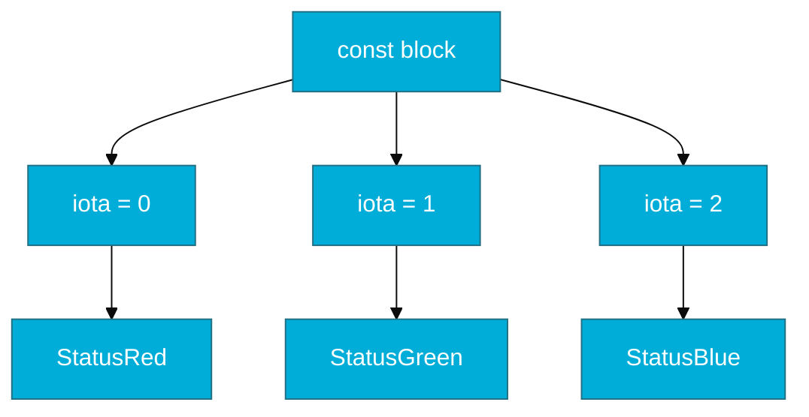

# CH-02: Constants (The Immutable Truth)

> **"Constants in Go are not just variables that don't change; they are part of the type system's logic."**

---

## 1. Tahap 1: Source Alignments & Judul
- **Source Link**: [Go Spec: Constants](https://go.dev/ref/spec#Constants)
- **Analogi**: **Ukuran Sepatu Standar**. Sekali ukuran 42 ditentukan pabrik, ia tidak akan pernah berubah. Anda bisa menyontek ukuran tersebut ke banyak sepatu (variabel), namun ukuran standarnya tetap konstan.

---

## 2. Tahap 2: Concept & Essence

### Apa itu Konstanta di Go?
Konstanta adalah nilai yang ditentukan pada waktu kompilasi (compile-time) dan tidak dapat diubah selama runtime. Go mendukung konstanta numerik, string, dan boolean.

### Why & How?
- **Untyped Constants**: Go memiliki fitur unik di mana sebuah konstanta bisa tidak memiliki tipe data yang spesifik (*untyped*) sampai ia digunakan. Ini memberikan fleksibilitas tinggi tanpa melanggar *Type Safety*.
- **Enum via Iota**: Go tidak memiliki kata kunci `enum`. Sebagai gantinya, Go menggunakan `iota` (an integer generator) di dalam blok `const` untuk membuat urutan nilai secara otomatis.

### Terminologi Teknis
- **Compile-time Constant**: Nilai yang dievaluasi langsung oleh compiler, bukan saat program dijalankan.
- **Enumeration**: Teknik memberikan nama pada sekumpulan nilai tetap.

---

## 3. Tahap 3: Visualisasi Sistem (Iota)

---

## 4. Tahap 4: Mekanisme Pembuktian (In-place Replacement)

Bagaimana konstanta bekerja di level biner?
- Berbeda dengan variabel yang memiliki alamat memori (`0x...`), konstanta seringkali tidak memiliki alamat memori jika mereka sederhana.
- **Detail Teknis**: Saat mengompilasi, Go compiler sering kali melakukan *literal substitution*. Artinya, di mana pun Anda memanggil konstanta `MaxSpeed`, compiler akan langsung menaruh angka `100` di sana. Ini membuat akses nilai konstanta jauh lebih cepat daripada variabel karena tidak ada proses "melihat isi alamat memori" (memory lookup).

---

## 5. Tahap 5: Multi-file Lab Praktis (Examples)

Melihat kekuatan `iota` dan fleksibilitas *untyped constants*.

- **Lab 1**: [01_iota_power.go](./examples/01_iota_power.go) - Menggunakan iota untuk status dan bitwise.

---
*Status: [x] Complete (Gold Standard)*
