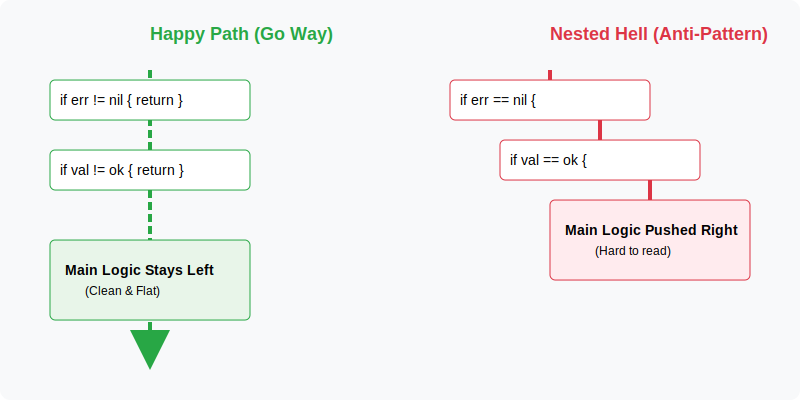
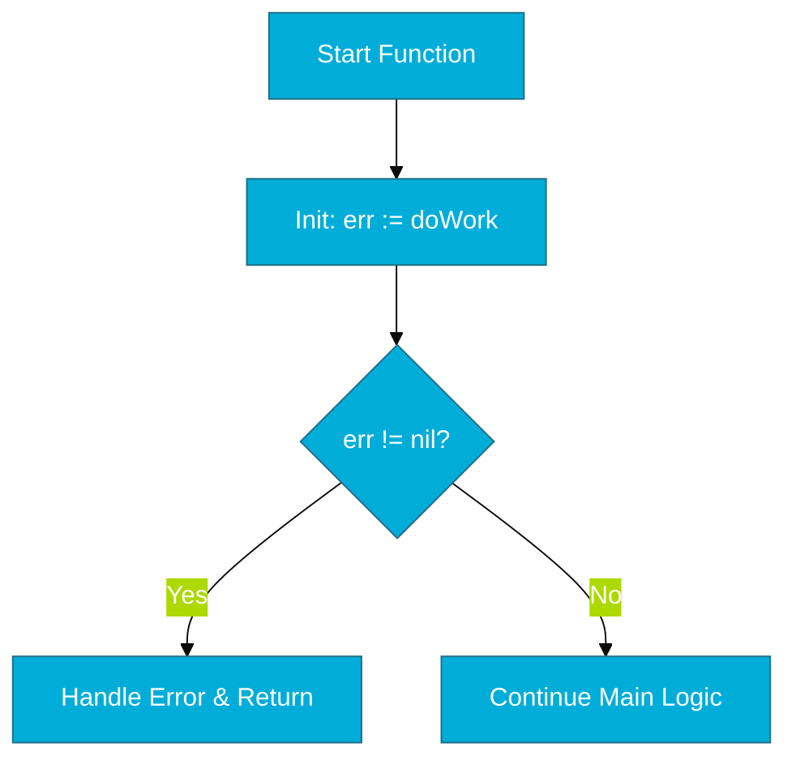

# CH-01: If/Else (The Fork in the Road)

> **"In Go, simplicity means having fewer branches, but making them more powerful via scoped initialization."**

---

## 1. Tahap 1: Source Alignments & Judul
- **Source Link**: [Go Spec: If Statements](https://go.dev/ref/spec#If_statements)

---

## 2. Tahap 2: Konsep & Esensi

### Definisi ("Apa itu?")
`if` adalah struktur kontrol kondisional paling dasar di Go yang mengeksekusi blok kode hanya jika ekspresi boolean di dalamnya bernilai `true`. Go tidak menggunakan tanda kurung `()` di sekitar kondisi, namun mewajibkan tanda kurung kurawal `{}`.

### Physical Representation (Premium Asset)

- **Clean Namespace**: Go mendukung *short statement* sebelum kondisi (e.g., `if err := call(); err != nil`). Ini memungkinkan kita mendeklarasikan variabel sementara yang hanya hidup di dalam blok `if`, menjaga agar *namespace* fungsi tidak dikotori oleh variabel yang tidak diperlukan di tempat lain.
- **Early Return Pattern**: Senior Go Engineer lebih memilih pola "Happy Path on the Left", di mana kondisi error ditangani secepat mungkin (early return) untuk menjaga agar logika utama tetap rata di sisi kiri identasi.

### Analogi Model Mental
**Rel Kereta Api**. Bayangkan jalur kereta api yang bercabang. Jika kereta memiliki muatan tertentu (kondisi), ia akan diarahkan ke jalur cabang (blok `if`) untuk pemrosesan khusus. Setelah selesai, ia kembali ke jalur utama atau berhenti di depo (return).

### Terminologi Teknis
- **Short Statement**: Deklarasi dan inisialisasi variabel tepat sebelum pengecekan kondisi.
- **Boolean Expression**: Evaluasi murni `true` atau `false` (Go tidak mengenal "truthy" atau "falsy" seperti JavaScript).

---

## 3. Tahap 3: Visualisasi Sistem

### High-Level Model (Mermaid)

---

## 4. Tahap 4: Mekanisme Pembuktian (Scoped Initialization)

Bagaimana Go mengelola variabel di dalam `if`?
- **Cyclomatic Complexity**: Sebagai senior engineer, kita menggunakan `if` secara bijak untuk menjaga skor kompleksitas kode tetap rendah. Pola `if-else if-else` yang terlalu dalam meningkatkan risiko bug karena setiap tingkat percabangan menambah beban kognitif saat membaca kode.
- **Lexical Block**: Variabel yang dideklarasikan di bagian *initialization* `if` (misal: `if v := get(); ...`) memiliki scope yang mencakup seluruh blok `if` beserta `else if` atau `else` terkait.
- **Detail Teknis**: Begitu program keluar dari seluruh struktur `if/else`, variabel `v` akan segera dihapus dari visibilitas *stack frame*, membebaskan memori lebih cepat dan mencegah bug "salah variabel" di baris selanjutnya.

---

## 5. Tahap 5: Multi-file Lab Praktis (Examples)

Mempraktikkan penulisan `if` yang idiomatik dan aman.

- **Lab 1**: [01_basic_if.go](./examples/01_basic_if.go) - Sintaks dasar dan short statements.
- **Lab 2**: [02_early_return.go](./examples/02_early_return.go) - Penerapan pola *Happy Path* pada fungsi pemrosesan data.

---
*Status: [x] Complete (Gold Standard - PPM V4)*
