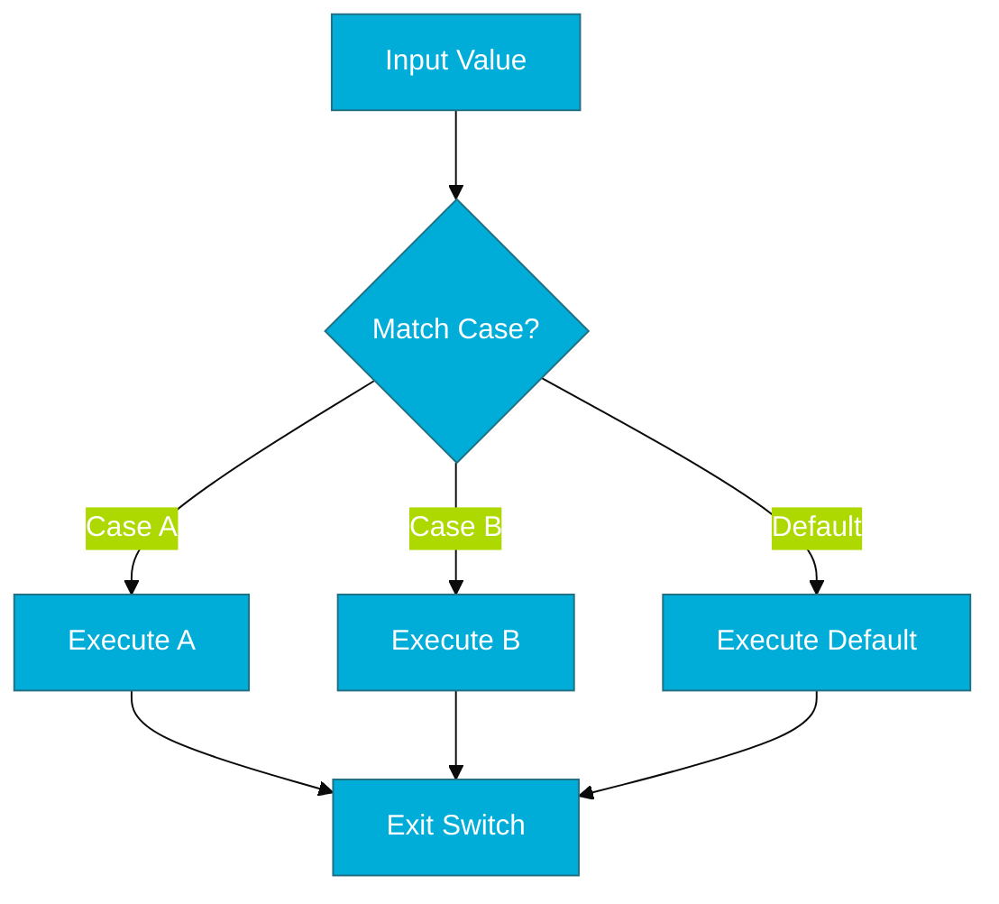

# CH-02: Switch/Case (The Dispatcher)

> **"Switch in Go is cleaner, more flexible, and safer by default—no implicit fallthrough means fewer bugs."**

---

## 1. Tahap 1: Source Alignments & Judul
- **Source Link**: [Go Spec: Switch Statements](https://go.dev/ref/spec#Switch_statements)

---

## 2. Tahap 2: Konsep & Esensi

### Definisi ("Apa itu?")
`switch` adalah cara ringkas untuk mengeksekusi satu blok kode berdasarkan nilai dari sebuah ekspresi. Di Go, `switch` bisa digunakan tanpa ekspresi (sama seperti `if-else if` raksasa) dan memiliki fitur unik: **Implicit Break**.

### Rasionalitas ("Why & How?")
- **Clarity**: Menghindari tumpukan `else if` yang sulit dibaca.
- **Safety (Default No-Fallthrough)**: Berbeda dari C/Java/JS, Go tidak akan melanjutkan eksekusi ke `case` berikutnya kecuali kita menulis kata kunci `fallthrough` secara eksplisit.
- **Flexibility**: `case` di Go bisa berisi list nilai (`case 1, 2, 3:`) atau bahkan ekspresi boolean yang kompleks jika `switch` dideklarasikan tanpa syarat.

### Analogi Model Mental
**Penyortir Surat**. Bayangkan mesin pembagi surat di kantor pos. Mesin melihat label kota pada surat (ekspresi) dan langsung menjatuhkannya ke kotak yang tepat (case). Begitu masuk ke satu kotak, surat tersebut tidak akan berpindah ke kotak lain secara tidak sengaja.

### Terminologi Teknis
- **Expression Switch**: Membandingkan satu nilai terhadap banyak kemungkinan.
- **Tagless Switch**: Switch tanpa ekspresi awal (bertindak sebagai rangkaian if-else).
- **Fallthrough**: Perintah manual untuk mengabaikan 'break' otomatis.

---

## 3. Tahap 3: Visualisasi Sistem

### High-Level Model (Mermaid)

---

## 4. Tahap 4: Mekanisme Pembuktian (Jump Tables vs Linear Search)

Bagaimana compiler mengoptimalkan `switch`?
- **Binary Search & Jump Tables**: Jika nilai `case` adalah angka yang berdekatan atau berurutan, compiler Go akan menciptakan tabel alamat di memori (*Jump Table*). CPU bisa langsung "melompat" ke alamat yang benar dalam waktu konstan (*O(1)*).
- **Linear Search**: Jika `case` adalah string atau nilai yang tidak beraturan, compiler akan melakukan pengecekan satu per satu (*O(n)*).
- **Detail Teknis**: Ini berarti `switch` seringkali lebih cepat daripada rangkaian `if-else` panjang di level instruksi mesin CPU.

---

## 5. Tahap 5: Multi-file Lab Praktis (Examples)

Mengeksplorasi berbagai variasi penggunaan `switch`.

- **Lab 1**: [01_basic_switch.go](./examples/01_basic_switch.go) - Penggunaan standar dan multi-value cases.
- **Lab 2**: [02_tagless_switch.go](./examples/02_tagless_switch.go) - Menggunakan switch sebagai pengganti if-else yang kompleks.

---
*Status: [x] Complete (Gold Standard - PPM V4)*
