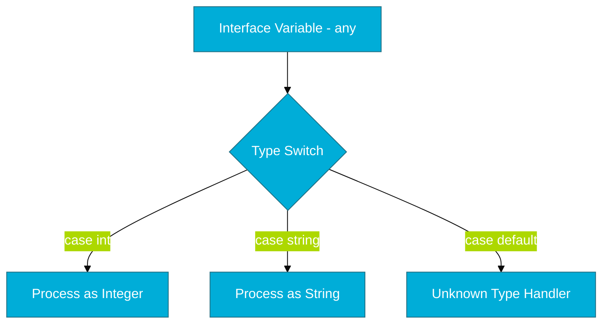

# CH-03: Type Switch Intro (The Dynamic Dispatcher)

> **"A type switch is a multi-way branch that logicizes based on the type of an interface, not just its value."**

---

## 1. Tahap 1: Source Alignments & Judul
- **Source Link**: [Go Spec: Type Switches](https://go.dev/ref/spec#Type_switches)

---

## 2. Tahap 2: Konsep & Esensi

### Definisi ("Apa itu?")
**Type Switch** adalah bentuk khusus dari `switch` yang digunakan untuk membandingkan tipe data dari sebuah *interface* terhadap beberapa kemungkinan tipe data. Ini adalah cara Go melakukan *Safe Type Casting* secara massal.

### Rasionalitas ("Why & How?")
- **Polymorphism Handling**: Saat bekerja dengan `interface{}`, kita seringkali tidak tahu tipe data aslinya. Type switch memberikan mekanisme yang bersih dan aman untuk mengekstrak data asli tanpa menyebabkan *panic* (seperti pada *Type Assertion* biasa).
- **Generic-like Logic**: Sebelum adanya Generics di Go 1.18, type switch adalah senjata utama untuk membuat fungsi yang bisa menerima berbagai macam tipe data (e.g., formatter JSON).

### Analogi Model Mental
**Sinar-X di Bea Cukai**. Bayangkan sebuah koper (Interface) yang isinya tidak diketahui. Type Switch adalah mesin Sinar-X yang memindai isinya. Jika isinya adalah "Buku", ia diarahkan ke jalur A. Jika "Elektronik", ke jalur B. Mesin ini memastikan kita menangani barang tersebut sesuai dengan sifat fisiknya.

### Terminologi Teknis
- **Type Guard**: Mekanisme untuk memastikan keamanan tipe data sebelum diproses.
- **Dynamic Type**: Tipe data asli yang tersimpan di dalam sebuah variabel interface saat runtime.

---

## 3. Tahap 3: Visualisasi Sistem

### High-Level Model (Mermaid)

---

## 4. Tahap 4: Mekanisme Pembuktian (Interface Inspection)

Bagaimana Go mengetahui tipe data di balik interface?
- **itabs & efaced**: Di balik layar, sebuah interface `any` (eface) memiliki pointer ke nilai asli dan pointer ke deskripsi tipe data (*type descriptor*).
- **Runtime Comparison**: Saat type switch berjalan, Go Runtime membandingkan pointer deskripsi tipe tersebut dengan daftar `case` yang Anda buat. Proses ini sangat cepat karena hanya berupa perbandingan pointer alamat memori tipe data.

---

## 5. Tahap 5: Multi-file Lab Praktis (Examples)

Mengenal cara kerja pendeteksian tipe secara dinamis.

- **Lab 1**: [01_type_detector.go](./examples/01_type_detector.go) - Fungsi yang merespon berbeda berdasarkan tipe input.

---
*Status: [x] Complete (Gold Standard - PPM V4)*
