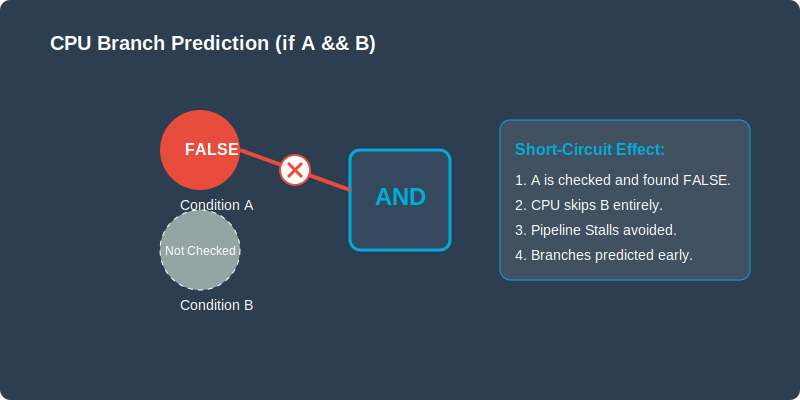
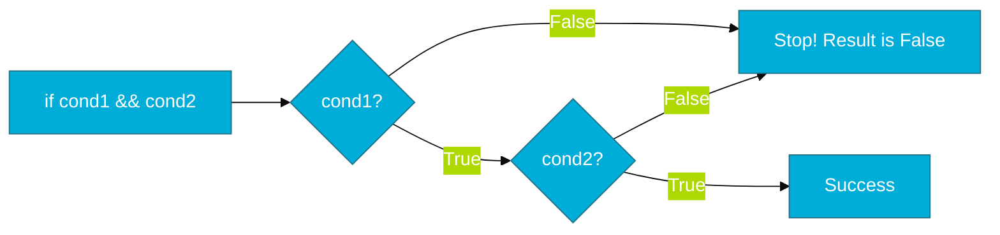

# CH-04: Logic Efficiency (The Path of Least Resistance)

> **"Efficient logic is not about writing more code, but about ensuring the CPU does as little work as possible to get the answer."**

---

## 1. Tahap 1: Source Alignments & Judul
- **Source Link**: [Go Spec: Logical Operators](https://go.dev/ref/spec#Logical_operators)

### Physical Representation (Premium Asset)

---

## 2. Tahap 2: Konsep & Esensi

### Definisi ("Apa itu?")
**Logic Efficiency** adalah teknik penyusunan ekspresi boolean (`&&` dan `||`) agar meminimalkan beban komputasi melalui mekanisme *Short-Circuiting*.

### Rasionalitas ("Why & How?")
- **Performance Optimization**: Jika kita memiliki `if A && B`, dan `A` sudah bernilai `false`, Go tidak akan repot mengevaluasi `B`. Jika `B` adalah pemanggilan fungsi yang mahal (misal: query database), teknik ini bisa menghemat waktu eksekusi secara drastis.
- **Safety**: Memungkinkan pengecekan pointer `nil` di bagian kiri agar bagian kanan tidak menyebabkan `panic` (e.g., `if ptr != nil && ptr.Value > 0`).

### Analogi Model Mental
**Pintu Berlapis**. Bayangkan sebuah gedung dengan dua pintu berurutan. Jika pintu pertama terkunci (kondisi pertama gagal), pencuri tidak akan mencoba membuka pintu kedua. Anda cukup memeriksa pintu pertama untuk tahu bahwa gedung itu aman (false).

### Terminologi Teknis
- **Short-Circuit Evaluation**: Penghentian evaluasi ekspresi segera setelah hasilnya sudah bisa dipastikan.
- **Lazy Evaluation**: Penundaan evaluasi kondisi sampai benar-benar dibutuhkan.

---

## 3. Tahap 3: Visualisasi Sistem

### High-Level Model (Mermaid)

---

## 4. Tahap 4: Mekanisme Pembuktian (Jump Instructions)

Bagaimana CPU menangani efisiensi logika ini?
- **Jump Instructions (JE/JNE)**: Compiler Go menerjemahkan ekspresi `&&` menjadi serangkaian instruksi "lompat" di level Assembly. Jika kondisi pertama gagal, CPU langsung diarahkan ke alamat memori setelah blok `if`.
- **Branch Prediction Tuning**: Penyusunan kondisi yang paling sering terjadi di depan (seperti pengecekan error yang jarang terjadi) membantu CPU memprediksi alur eksekusi dengan lebih baik, mengurangi penundaan (*stalls*) pada pipa hardware (*pipeline*).
- **Speculative Execution**: CPU modern terkadang "menebak" hasil dari `if` sebelum evaluasi selesai untuk mempercepat proses. Logika yang bersih dan dapat diprediksi membantu efektivitas fitur hardware ini.

---

## 5. Tahap 5: Multi-file Lab Praktis (Examples)

Melihat perbedaan performa antara logika yang efisien dan yang tidak.

- **Lab 1**: [01_short_circuit.go](./examples/01_short_circuit.go) - Demonstrasi penghematan waktu eksekusi.

---
*Status: [x] Complete (Gold Standard - PPM V4)*
