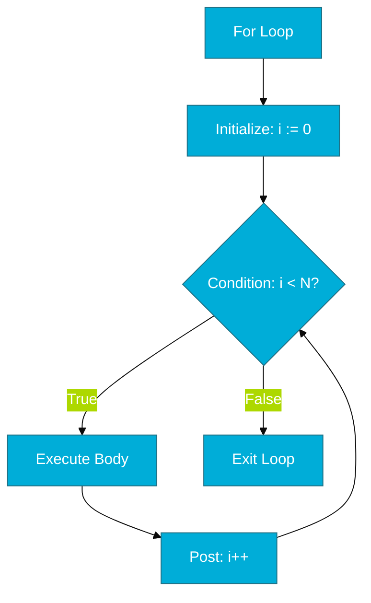

# CH-01: For Loop (The Unified Iterator)

> **"Go has only one looping construct: the for loop. It's simple, powerful, and intentionally designed to replace while, do-while, and traditional iteration."**

---

## 1. Tahap 1: Source Alignments & Judul
- **Source Link**: [Go Spec: For Statements](https://go.dev/ref/spec#For_statements)

---

## 2. Tahap 2: Konsep & Esensi

### Definisi ("Apa itu?")
`for` adalah satu-satunya mekanisme perulangan di Go. Go tidak memiliki kata kunci `while` atau `do-while`, karena struktur `for` yang sangat fleksibel dapat meniru semua jenis perulangan tersebut hanya dengan membuang komponen opsionalnya.

### Rasionalitas ("Why & How?")
- **Keyword Economy**: Dengan hanya memiliki satu kata kunci perulangan, bahasa Go menjadi lebih ringan dan lebih mudah dipelajari. Tidak ada perdebatan tentang kapan harus menggunakan `while` vs `for`.
- **Infinite Loop Efficiency**: Menggunakan `for {}` tanpa kondisi adalah cara standar di Go untuk membuat loop tak terbatas. Ini sangat efisien dan idiomatik untuk *worker loops* atau *server listeners*.

### Analogi Model Mental
**Lingkaran Trek Balap**. Bayangkan sebuah trek balap. Anda bisa berlari 10 putaran (C-style), berlari selama Anda masih kuat (while-style), atau berlari selamanya sampai ada instruksi berhenti (infinite). Meskipun gayanya berbeda, Anda tetap menggunakan trek yang sama (`for`).

### Terminologi Teknis
- **Infinite Loop**: Perulangan tanpa henti (`for {}`).
- **Initial/Condition/Post**: Tiga bagian utama dalam struktur loop standar C-style.

---

## 3. Tahap 3: Visualisasi Sistem

### High-Level Model (Mermaid)

---

## 4. Tahap 4: Mekanisme Pembuktian (Loop Performance)

Bagaimana Go menangani loop di belakang layar?
- **Register Allocation**: Compiler Go mengoptimalkan variabel penghitung (seperti `i`) untuk diletakkan langsung di register CPU (misal: `RAX`), bukan di memori (RAM). Ini membuat perulangan berjalan secepat mungkin.
- **No-Op Removal**: Jika compiler mendeteksi sebuah loop tidak melakukan apa pun (empty loop) yang tidak relevan bagi sistem, Go mungkin akan mengoptimalkannya atau justru memberikan peringatan karena loop kosong tanpa jeda waktu dapat membuat CPU *hang* (100% usage).

---

## 5. Tahap 5: Multi-file Lab Praktis (Examples)

Mengenal berbagai variasi `for` di Go.

- **Lab 1**: [01_all_variants.go](./examples/01_all_variants.go) - Menyamar sebagai while, do-while, dan infinite loop.

---
*Status: [x] Complete (Gold Standard - PPM V4)*
