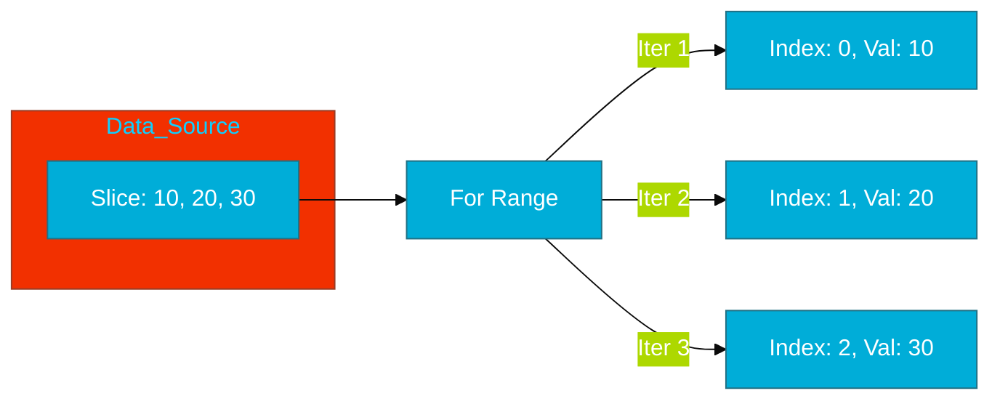

# CH-02: Range Loop (The Collection Iterator)

> **"The range clause is the most idiomatic way to iterate over slices, maps, and channels, but it holds a legendary pitfall—at least until Go 1.22."**

---

## 1. Tahap 1: Source Alignments & Judul
- **Source Link**: [Go Spec: For Statements with Range](https://go.dev/ref/spec#For_range)

---

## 2. Tahap 2: Konsep & Esensi

### Definisi ("Apa itu?")
`for range` adalah varian khusus dari perulangan yang digunakan untuk mengekstrak elemen demi elemen dari tipe data koleksi (Slice, Array, Map, Channel, atau String) secara otomatis.

### Rasionalitas ("Why & How?")
- **Safety & Clarity**: Menghapus kebutuhan untuk mengelola index secara manual (`i++`), yang seringkali menyebabkan bug *index out of bounds*.
- **The Copy Behavior**: Secara default, `range` memberikan **salinan** dari nilai elemen, bukan alamatnya. Mengubah variabel iterasi tidak akan mengubah isi asli koleksi tersebut.
- **Go 1.22 Revolution**: Sebelum Go 1.22, variabel iterasi digunakan ulang di setiap putaran, sering menyebabkan bug saat bekerja dengan Goroutine. Sejak Go 1.22, setiap iterasi mendapatkan instansi variabel yang unik secara otomatis.

### Analogi Model Mental
**Sabuk Konveyor (Conveyor Belt)**. Bayangkan Anda sedang berdiri di depan sabuk konveyor yang membawa barang. `for range` adalah tangan robot yang mengambil barang satu per satu dan meletakkannya di depan Anda. Anda bisa memegang barangnya, tapi barang aslinya tetap aman di jalurnya kecuali Anda menjangkaunya secara manual.

### Terminologi Teknis
- **Iteration Variable**: Variabel penampung nilai saat loop berjalan.
- **Pointer Pitfall**: Bug klasik di mana semua goroutine menunjuk ke nilai terakhir di loop (Sembuh di Go 1.22).

---

## 3. Tahap 3: Visualisasi Sistem

### High-Level Model (Mermaid)

---

## 4. Tahap 4: Mekanisme Pembuktian (The Hidden Copies)

Apa yang sebenarnya terjadi di memori saat kita menggunakan `range`?
- **Value Semantics**: Saat Anda melakukan `for i, v := range slice`, Go menyalin nilai dari `slice[i]` ke variabel `v`. Artinya, biaya CPU-nya adalah biaya penyalinan. Untuk struct yang sangat besar, ini bisa berdampak pada performa.
- **Map Iteration Randomness**: Go secara sengaja merandom urutan iterasi pada `map`. Mengapa? Agar engineer tidak bergantung pada urutan input, karena secara fisik `map` adalah *hash table* yang tidak terurut.
- **Detail Teknis**: Jika Anda hanya butuh index, gunakan `for i := range slice`. Ini lebih efisien karena Go tidak perlu menyalin datanya ke variabel nilai kedua.

---

## 5. Tahap 5: Multi-file Lab Praktis (Examples)

Melihat perilaku range pada berbagai tipe data dan menguji fitur Go 1.22.

- **Lab 1**: [01_range_behaviors.go](./examples/01_range_behaviors.go) - Perbedaan range pada slice vs map.
- **Lab 2**: [02_go122_fix.go](./examples/02_go122_fix.go) - Membuktikan perbaikan variable shadowing pada Go terbaru.

---
*Status: [x] Complete (Gold Standard - PPM V4)*
