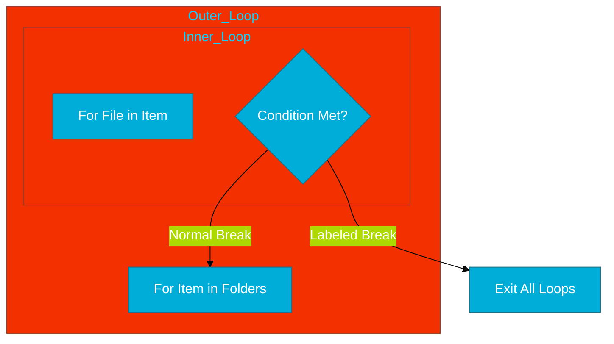

# CH-03: Loop Control & Labels (The Escape Routes)

> **"Labels provide a precise way to control flow in nested loops, avoiding complex boolean flags for exits."**

---

## 1. Tahap 1: Source Alignments & Judul
- **Source Link**: [Go Spec: Break Statements](https://go.dev/ref/spec#Break_statements) / [Continue Statements](https://go.dev/ref/spec#Continue_statements)

---

## 2. Tahap 2: Konsep & Esensi

### Definisi ("Apa itu?")
**Labels** adalah penanda identitas yang ditempelkan sebelum sebuah blok `for`, `switch`, atau `select`. Kata kunci `break` dan `continue` dapat merujuk pada label ini untuk menentukan tingkat perulangan mana yang ingin dikontrol.

### Rasionalitas ("Why & How?")
- **Nested Loop Exit**: Tanpa label, `break` hanya akan mengeluarkan kita dari loop terdalam. Untuk keluar dari 3 lapis loop sekaligus, biasanya orang menggunakan variabel boolean `found := true`. Labels menghapus kebutuhan variabel sampah tersebut, membuat kode lebih bersih (*clean code*).
- **Legibility**: Memberikan nama pada loop (misal: `OuterLoop:`) membantu pembaca kode memahami maksud dari redundansi perulangan tersebut secara semantik.

### Analogi Model Mental
**Keluar Gedung vs Keluar Ruangan**. Jika Anda berada di sebuah ruangan di dalam gedung bertingkat, `break` biasa adalah seperti keluar dari ruangan tersebut ke koridor. `break LabelGedung` adalah seperti langsung menggunakan pintu darurat untuk keluar dari seluruh gedung ke jalan raya.

### Terminologi Teknis
- **Labeled Statement**: Pernyataan yang didahului oleh pengenal (label) dan titik dua.
- **Scope of Labels**: Label hanya terlihat di dalam fungsi di mana ia dideklarasikan.

---

## 3. Tahap 3: Visualisasi Sistem

### High-Level Model (Mermaid)

---

## 4. Tahap 4: Mekanisme Pembuktian (Jump to Target)

Bagaimana Go menangani `break label` di level mesin?
- **Direct Jump (JMP)**: Compiler Go tidak melakukan pengecekan flag berulang. Ia cukup menaruh instruksi `JMP` (Jump) langsung ke alamat instruksi setelah blok loop yang berlabel.
- **Stack Integrity**: Meskipun kita melompat keluar dari blok kode yang dalam, Go Runtime memastikan integritas *stack* dan variabel lokal tetap terjaga tanpa kebocoran data.

---

## 5. Tahap 5: Multi-file Lab Praktis (Examples)

Mempraktikkan teknik keluar dari loop berlapis.

- **Lab 1**: [01_labeled_break.go](./examples/01_labeled_break.go) - Mencari data di dalam tabel 2D.

---
*Status: [x] Complete (Gold Standard - PPM V4)*
