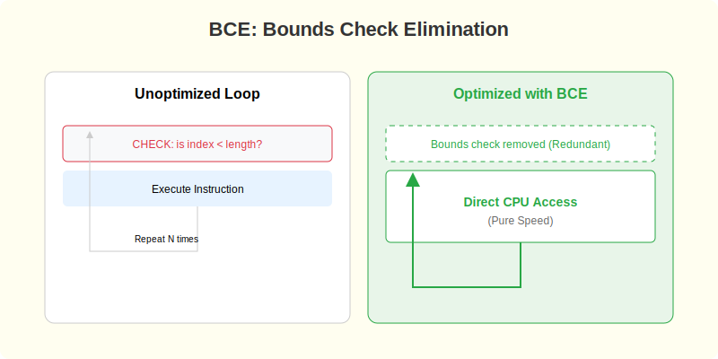

# CH-04: Collection Optimization (The High-Speed Iteration)

> **"Iteration is cheap, but memory allocation inside iteration is expensive."**

### Physical Representation (Premium Asset)

---

## 1. Tahap 1: Source Alignments & Judul
- **Source Link**: [Go Blog: Efficiency](https://go.dev/blog/slices)

---

## 2. Tahap 2: Konsep & Esensi

### Definisi ("Apa itu?")
**Collection Optimization** adalah strategi untuk meningkatkan performa perulangan dengan meminimalkan alokasi memori dinamis (*Heap Allocation*) dan memanfaatkan pola akses data yang efisien.

### Rasionalitas ("Why & How?")
- **Pre-allocation**: Melakukan `make([]T, length)` sebelum loop dimulai jauh lebih cepat daripada menggunakan `append()` berulang kali di dalam loop yang memicu *resizing* memori terus-menerus.
- **Cache Locality**: CPU lebih cepat memproses data yang bersebelahan di memori (seperti Slice/Array) daripada data yang terpencar (seperti Map). Memilih struktur data yang tepat untuk perulangan massal adalah tugas engineer senior.

### Analogi Model Mental
**Menyusun Piring**. Bayangkan Anda harus menyusun 100 piring. Lebih cepat jika Anda menyiapkan sebuah rak yang sudah memiliki 100 sekat (Pre-allocation) daripada Anda harus membuat satu sekat baru setiap kali ada satu piring datang (Append/Resize).

### Terminologi Teknis
- **Capacity vs Length**: Kapasitas total memori yang dipesan vs jumlah elemen yang digunakan.
- **Allocation amortized**: Biaya rata-rata penambahan elemen pada koleksi.

---

## 3. Tahap 3: Visualisasi Sistem

### High-Level Model (Mermaid)

---

## 4. Tahap 4: Mekanisme Pembuktian (BCE - Bounds Check Elimination)

Bagaimana Go mempercepat loop kita secara cerdas?
- **Escape Analysis in Loops**: Jika Anda membuat slice besar atau pointer di dalam loop yang kemudian dikembalikan keluar fungsi, Go akan mendeteksi ini sebagai "Escaping to Heap". Pengalokasian di Heap di dalam perulangan jutaan kali adalah pembunuh performa utama di Go karena memicu GC berlebihan.
- **Bounds Check Elimination (BCE)**: Biasanya, Go mengecek apakah index kita berada di dalam batas slice (keamanan). Namun, jika compiler yakin bahwa loop kita tidak akan melampaui batas (misal: `for i := 0; i < len(s); i++`), ia akan menghapus instruksi pengecekan tersebut di level Assembly untuk menambah kecepatan.
- **Detail Teknis**: Menulis loop dengan pola yang dikenali compiler membantu aktivasi optimasi BCE ini.

---

## 5. Tahap 5: Multi-file Lab Praktis (Examples)

Membandingkan kecepatan iterasi dengan dan tanpa optimasi.

- **Lab 1**: [01_bench_alloc.go](./examples/01_bench_alloc.go) - Sederhana perbandingan kecepatan alokasi.

---
*Status: [x] Complete (Gold Standard - PPM V4)*
