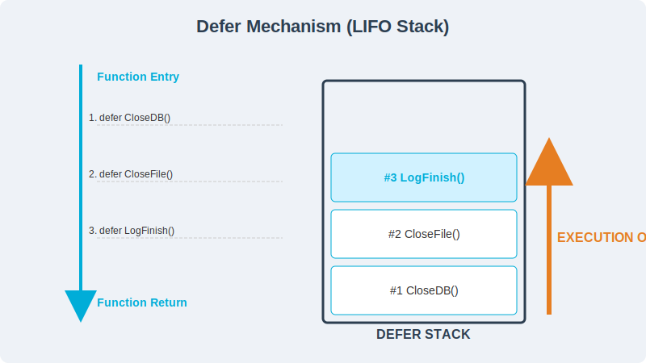
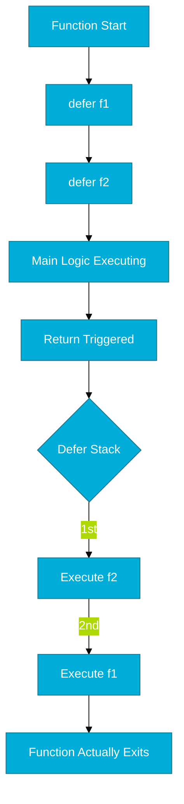

# CH-01: Defer Mechanism (The Resource Guard)

> **"Defer is the elegant way to ensure resources are cleaned up, no matter how a function exits."**

### Physical Representation (Premium Asset)

---

## 1. Tahap 1: Source Alignments & Judul
- **Source Link**: [Go Spec: Defer Statements](https://go.dev/ref/spec#Defer_statements)

---

## 2. Tahap 2: Konsep & Esensi

### Definisi ("Apa itu?")
`defer` adalah pernyataan yang menunda eksekusi sebuah fungsi tepat sebelum fungsi yang membungkusnya selesai (*returned*). Ini sering digunakan untuk menutup file, membuka kunci mutex, atau menutup koneksi database.

### Rasionalitas ("Why & How?")
- **Maintenance Safety**: Dengan meletakkan kode pembersihan (`Close()`) tepat di bawah kode pembukaan (`Open()`), kita mencegah bug kelupaan menutup sumber daya yang bisa menyebabkan *memory leak* atau *file descriptor exhaustion*.
- **Failure Resilience**: `defer` tetap akan dijalankan meskipun fungsi tersebut mengalami `panic` atau keluar di tengah jalan karena error. Ini menjamin keamanan sistem.

### Analogi Model Mental
**Pencuci Piring**. Saat Anda mulai memasak (membuka file), Anda berkomitmen untuk mencuci piring (defer) di akhir. Tak peduli masakannya gosong atau sukses, cuci piring adalah hal terakhir yang Anda lakukan sebelum meninggalkan dapur.

### Terminologi Teknis
- **LIFO (Last-In-First-Out)**: Urutan eksekusi `defer` di mana yang terakhir didaftarkan adalah yang pertama dijalankan.
- **Deferred Call**: Panggilan fungsi yang antri untuk dieksekusi di akhir fungsi.

---

## 3. Tahap 3: Visualisasi Sistem

### High-Level Model (Mermaid)

---

## 4. Tahap 4: Mekanisme Pembuktian (Argument Evaluation)

Kapan argumen fitur `defer` dievaluasi?
- **Penting**: Nilai argumen dalam fungsi `defer` dievaluasi **saat itu juga** (ketika `defer` dipanggil), bukan saat fungsi dijalankan di akhir.
- **Detail Teknis**: Go compiler menyiapkan parameter fungsi `defer` pada saat pendaftaran. Ini berarti jika Anda mempassing variabel yang nilainya berubah nanti, fungsi `defer` akan tetap menggunakan nilai variabel saat `defer` didefinisikan.
- **Open-coded Defer (Go 1.13+)**: Sejak Go 1.13, compiler mencoba mengoptimalkan `defer` menjadi instruksi inline jika memungkinkan (*open-coded*). Ini mengurangi overhead performa yang sebelumnya ada pada `defer` di versi Go lama, sehingga penggunaan `defer` kini hampir "gratis" di sebagian besar skenario.
- **Heap vs Stack**: Go Runtime menyimpan daftar panggul defer dalam sebuah struktur link-list yang dikelola secara internal untuk memastikan integritas pemanggilan LIFO.

---

## 5. Tahap 5: Multi-file Lab Praktis (Examples)

Memahami urutan eksekusi `defer` dan perilaku argumen.

- **Lab 1**: [01_defer_order.go](./examples/01_defer_order.go) - Membuktikan sifat LIFO.
- **Lab 2**: [02_argument_eval.go](./examples/02_argument_eval.go) - Demonstrasi evaluasi argumen yang sering menipu koder baru.

---
*Status: [x] Complete (Gold Standard - PPM V4)*
