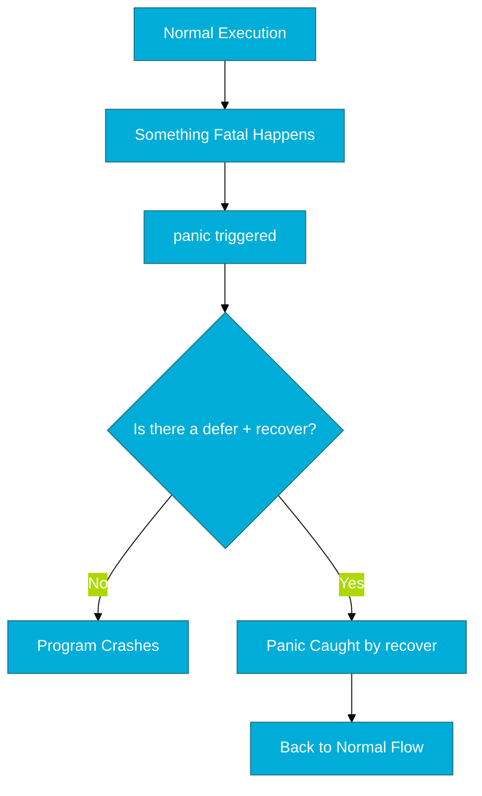

# CH-02: Panic and Recover (The Safety Net)

> **"Don't panic! But if you must, make sure you know how to recover."**

---

## 1. Tahap 1: Source Alignments & Judul
- **Source Link**: [Defer, Panic, and Recover (Go Blog)](https://go.dev/blog/defer-panic-and-recover)

---

## 2. Tahap 2: Konsep & Esensi

### Definisi ("Apa itu?")
`panic` adalah mekanisme untuk menghentikan alur program secara mendadak saat terjadi kesalahan fatal yang tidak terduga. `recover` adalah fungsi bawaan yang bisa menangkap `panic` dan mencegah program berhenti total (*crash*).

### Rasionalitas ("Why & How?")
- **Exceptional Failures**: `panic` bukan untuk penanganan error biasa (seperti file tidak ditemukan). Gunakan `panic` hanya jika sistem berada dalam kondisi yang tidak bisa dipulihkan (e.g., inisialisasi driver penting gagal).
- **Service Resilience**: `recover` digunakan di level web-server atau worker agar jika satu request gagal total, seluruh server tidak ikut mati, melainkan hanya membuang request tersebut dan tetap melayani yang lain.

### Analogi Model Mental
**Rem Darurat (Emergency Brake)**. `panic` adalah rem darurat di kereta api. Anda menariknya hanya jika ada bahaya fatal di depan. `recover` adalah tim teknisi yang bisa menyalakan kembali mesin kereta setelah rem ditarik, sehingga perjalanan bisa dilanjutkan tanpa harus mengganti seluruh rangkaian kereta.

### Terminologi Teknis
- **Runtime Error**: Panic yang dipicu secara otomatis oleh sistem (e.g., pembagian dengan nol).
- **Stop-the-world**: Keadaan di mana program berhenti mengeksekusi logika bisnis saat panic terjadi.

---

## 3. Tahap 3: Visualisasi Sistem

### High-Level Model (Mermaid)

---

## 4. Tahap 4: Mekanisme Pembuktian (Stack Unwinding)

Apa yang dilakukan Go saat `panic` terjadi?
- **Stack Unwinding**: Go akan segera mulai membongkar tumpukan fungsi (*stack*). Dalam proses ini, Go tetap akan mencari dan menjalankan seluruh fungsi `defer` yang terdaftar di sepanjang jalur keluar.
- **The Recover Trap**: `recover` hanya berfungsi jika dipanggil di dalam fungsi `defer`. Memanggil `recover` langsung di dalam kode normal tidak akan membuahkan hasil karena alur kode normal sudah terhenti saat panic.
- **Detail Teknis**: Saat `recover()` dipanggil, ia mengembalikan nilai yang dikirim ke `panic()`, dan mengembalikan kontrol aliran ke fungsi pemanggil dari fungsi yang mengalami panic.

---

## 5. Tahap 5: Multi-file Lab Praktis (Examples)

Belajar mengelola panic secara aman.

- **Lab 1**: [01_panic_recovery.go](./examples/01_panic_recovery.go) - Cara menangkap panic di dalam goroutine atau middleware sederhana.

---
*Status: [x] Complete (Gold Standard - PPM V4)*
