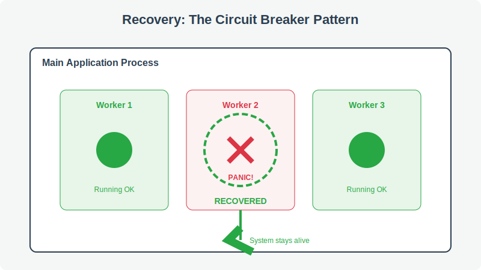
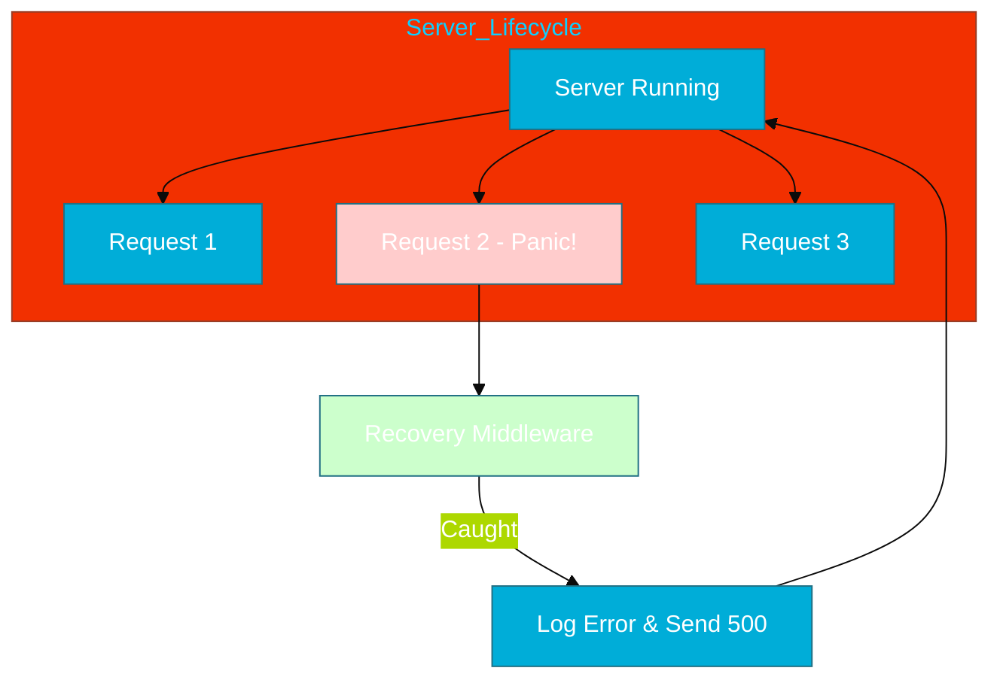

# CH-03: Recovery Patterns (The Resilience Architect)

> **"A senior engineer builds systems that can fail gracefully, ensuring that one faulty request doesn't bring down the entire cloud service."**

---

## 1. Tahap 1: Source Alignments & Judul
- **Source Link**: [Go HTTP Middleware Recovery](https://github.com/golang/go/blob/master/src/net/http/server.go) (Reference example)

---

## 2. Tahap 2: Konsep & Esensi

### Definisi ("Apa itu?")
**Recovery Patterns** adalah sekumpulan pola desain teknis untuk menangkap `panic` di titik-titik krusial aplikasi (seperti Middleware atau Goroutine) agar sistem tetap berjalan meskipun terjadi kesalahan fatal di salah satu bagian.

### Physical Representation (Premium Asset)

### Rasionalitas ("Why & How?")
- **Goroutine Isolation**: `panic` di dalam sebuah goroutine akan mematikan **seluruh program** jika tidak ditangkap di dalam goroutine itu sendiri. `recover` di fungsi `main` tidak bisa menangkap `panic` dari goroutine lain.
- **Service Availability**: Dalam aplikasi web, satu request yang menyebabkan *nil pointer* tidak boleh mematikan server yang sedang melayani ribuan pengguna lain. Pola *Recovery Middleware* adalah standar industri untuk menjaga ketersediaan layanan (*uptime*).

### Analogi Model Mental
**Sistem Sekring Listrik**. Bayangkan instalasi listrik di rumah besar. Jika terjadi korsleting di satu kamar (panic di satu goroutine), sekring di kamar tersebut akan putus (recover caught), namun lampu di ruang tamu dan dapur tetap menyala (program utama tetap berjalan).

### Terminologi Teknis
- **Recovery Middleware**: Fungsi yang membungkus handler HTTP untuk menangkap panic.
- **Safe Go**: Pola membungkus fungsi goroutine dengan `defer recover()` agar aman dijalankan.

---

## 3. Tahap 3: Visualisasi Sistem

### High-Level Model (Mermaid)

---

## 4. Tahap 4: Mekanisme Pembuktian (Panic Propagation)

Mengapa `recover` harus didefinisikan secara lokal di goroutine?
- **Goroutine Stack**: Setiap goroutine memiliki tumpukan fungsi (*stack*) sendiri. Saat panic terjadi, ia hanya melakukan *unwinding* pada stack-nya sendiri. Jika ia sampai ke dasar stack tanpa menemukan `recover`, ia memanggil `exit(2)` yang mematikan seluruh proses OS.
- **Detail Teknis**: Go tidak mendukung mekanisme "Try-Catch Global" lintas thread. Ini adalah keputusan desain untuk memaksa engineer bertanggung jawab atas keamanan setiap goroutine yang mereka buat.

---

## 5. Tahap 5: Multi-file Lab Praktis (Examples)

Menerapkan pola pengamanan goroutine.

- **Lab 1**: [01_safe_goroutine.go](./examples/01_safe_goroutine.go) - Membangun wrapper `SafeGo` sendiri.

---
*Status: [x] Complete (Gold Standard - PPM V4)*
