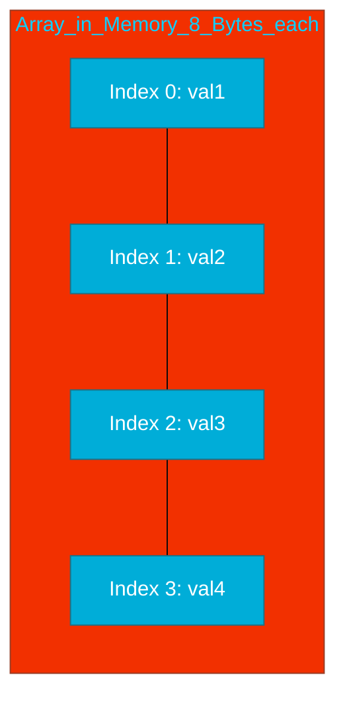

# CH-01: Arrays (The Static Base)

> **"Arrays are the bedrock of Go collections—fixed in size, powerful in their simplicity, and predictable in memory."**

---

## 1. Tahap 1: Source Alignments & Judul
- **Source Link**: [Go Spec: Array Types](https://go.dev/ref/spec#Array_types)

---

## 2. Tahap 2: Konsep & Esensi

### Definisi ("Apa itu?")
**Array** adalah tipe data koleksi yang berisi sekumpulan elemen dengan tipe data yang sama dan memiliki **ukuran tetap** yang ditentukan saat deklarasi. Ukuran array adalah bagian dari tipe datanya (e.g., `[3]int` berbeda dengan `[5]int`).

### Rasionalitas ("Why & How?")
- **Predictability**: Karena ukurannya tetap, compiler tahu persis berapa banyak memori yang harus dipesan saat program mulai berjalan.
- **Value Semantics**: Di Go, array adalah *value type*. Jika Anda mengirim array ke fungsi, Go akan menyalin **seluruh** isinya. Ini berbeda dengan bahasa lain yang sering mengirim referensi/pointer secara implisit.
- **Foundation for Slices**: Array adalah blok bangunan fisik di mana *Slices* (yang lebih fleksibel) dibangun di atasnya.

### Analogi Model Mental
**Rak Telur Kayu**. Bayangkan sebuah rak telur kayu yang dibuat untuk menampung tepat 10 telur. Anda tidak bisa menambah lubangnya di tengah jalan. Jika Anda ingin memindahkan isi rak tersebut ke tempat lain, Anda harus memindahkan fisiknya secara utuh atau menyalin isinya satu per satu.

### Terminologi Teknis
- **Composite Type**: Tipe data yang dibangun dari tipe data lain.
- **Memory Contiguity**: Elemen-elemen array disusun bersebelahan secara rapat di memori (sekuensial).

---

## 3. Tahap 3: Visualisasi Sistem

### Unit Memory Layout

---

## 4. Tahap 4: Mekanisme Pembuktian (Value Semantics & Stack)

Bagaimana Go mengelola Array di balik layar?
- **Stack Allocation**: Array dengan ukuran tetap yang dideklarasikan di dalam fungsi biasanya dialokasikan di **Stack**, bukan Heap. Ini membuat alokasi dan de-alokasi sangat cepat (hanya menggeser pointer stack).
- **Compile-time Bound Check**: Karena ukurannya diketahui saat kompilasi, compiler bisa mendeteksi kesalahan jika Anda mencoba mengakses index di luar batas (e.g. `arr[10]` pada array ukuran 5) bahkan sebelum program dijalankan.
- **No Overhead**: Array tidak memiliki "metadata" tambahan seperti *length* atau *capacity* yang disimpan saat runtime (tidak seperti Slice). Ukurannya sudah "tertanam" di dalam instruksi mesin.

---

## 5. Tahap 5: Multi-file Lab Praktis (Examples)

Eksperimen dengan Array, inisialisasi, dan pembuktian *Value Semantics*.

- **Lab 1**: [01_array_basics.go](./examples/01_array_basics.go) - Deklarasi, inisialisasi, dan iterasi.
- **Lab 2**: [02_value_copy.go](./examples/02_value_copy.go) - Membuktikan bahwa array disalin saat dikirim ke fungsi.

---
*Status: [x] Complete (Gold Standard - PPM V4)*
