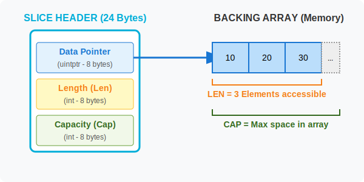

# CH-02: Slice Anatomy (Header)

> **"A slice does not store any data, it just describes a section of an underlying array."**

---

## 1. Tahap 1: Source Alignments & Judul
- **Source Link**: [Go Blog: Slices Anatomy](https://go.dev/blog/slices-intro)

---

## 2. Tahap 2: Konsep & Esensi

### Definisi ("Apa itu?")
**Slice** adalah abstraksi fleksibel di atas Array. Berbeda dengan Array yang merupakan *value type*, Slice adalah *reference-like type*. Slice secara internal adalah sebuah struktur kecil (Header) yang menunjuk ke sebuah "Backing Array".

### Rasionalitas ("Why & How?")
- **Practicality**: Kita jarang tahu ukuran data yang pasti di awal (misal: jumlah user dari DB). Slice memungkinkan kita menambah data tanpa pusing memikirkan ukuran fisik.
- **Efficiency**: Saat mengirim slice ke fungsi, Go hanya menyalin 24 byte (pada sistem 64-bit) terlepas dari berapa juta elemen yang ada di dalamnya. Ini karena yang disalin hanyalah **Header**-nya.

### Analogi Model Mental
**Jendela Bidik Kamera**. Bayangkan array adalah sebuah pemandangan yang sangat luas (Backing Array). Slice adalah jendela bidik kamera Anda. Anda bisa menggeser jendela tersebut, memperlebar, atau mempersempit pandangan Anda, tapi pemandangan aslinya tidak berubah. Jendela Anda hanya memiliki catatan: "Mulai dari koordinat mana (Ptr), seberapa lebar pandangan saat ini (Len), dan seberapa luas kapasitas maksimal yang bisa dilihat (Cap)".

### Terminologi Teknis
- **Backing Array**: Array fisik yang sebenarnya menyimpan data.
- **Slice Header**: Struktur internal Go yang terdiri dari 3 komponen: Pointer, Length, dan Capacity.

---

## 3. Tahap 3: Visualisasi Sistem

### The Slice Header Layout


---

## 4. Tahap 4: Mekanisme Pembuktian (The 24-Byte Header)

Apa yang sebenarnya terjadi di memori saat kita menggunakan `slice`?
- **Internal Struct**: Di level runtime, slice direpresentasikan oleh struct berikut (kurang lebih):
  ```go
  type SliceHeader struct {
      Data uintptr
      Len  int
      Cap  int
  }
  ```
- **Pointer Arithmetic**: Pointer di dalam header menunjuk ke elemen pertama yang bisa diakses oleh slice tersebut (tidak harus elemen ke-0 dari backing array).
- **Reference Semantics**: Karena slice menyimpan pointer ke memori yang sama, mengubah elemen di dalam slice akan mengubah data di backing array asli. Ini memungkinkan fungsi berbagi data tanpa menyalin seluruh koleksi.

---

## 5. Tahap 5: Multi-file Lab Praktis (Examples)

Membedah isi header slice dan membuktikan perilaku referensi.

- **Lab 1**: [01_slice_anatomy.go](./examples/01_slice_anatomy.go) - Mengamati perubahan `len` dan `cap`.
- **Lab 2**: [02_shared_backing.go](./examples/02_shared_backing.go) - Membuktikan dua slice yang menunjuk ke array yang sama.

---
*Status: [x] Complete (Gold Standard - PPM V4)*
