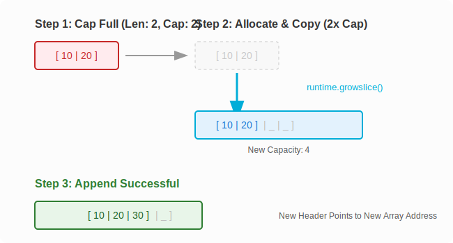

# CH-03: Dynamic Growth (Append)

> **"Append is a magic wand that transforms a static backing array into a dynamic collection, but it comes with a cost: potential reallocation."**

---

## 1. Tahap 1: Source Alignments & Judul
- **Source Link**: [Go Spec: Appending to and copying slices](https://go.dev/ref/spec#Appending_and_copying_slices)

---

## 2. Tahap 2: Konsep & Esensi

### Definisi ("Apa itu?")
**Dynamic Growth** adalah kemampuan slice untuk bertambah ukurannya melebihi kapasitas aslinya. Go menyediakan fungsi bawaan `append(s S, x ...Type) S` untuk menangani logika penambahan elemen secara otomatis.

### Rasionalitas ("Why & How?")
- **Abstraction over Arrays**: Karena Array berukuran tetap, kita tidak bisa "memperbesarnya". `append` menyembunyikan logika rumit: "cek sisa kapasitas, jika habis buat array baru yang lebih besar, salin data lama, tambahkan data baru".
- **Amortized Cost**: Untuk efisiensi, Go tidak menambah kapasitas hanya +1 setiap kali penuh. Go biasanya **menggandakan** kapasitas (untuk ukuran kecil) agar operasi `append` berikutnya menjadi sangat murah (*O(1) amortized*).

### Analogi Model Mental
**Gelas yang Bisa Membelah Diri**. Bayangkan Anda punya gelas kecil (Backing Array). Saat gelas penuh dan Anda ingin menuang air lagi, gelas tersebut secara ajaib menciptakan gelas baru yang ukurannya 2x lipat lebih besar, memindahkan air dari gelas lama, lalu membuang gelas lama tersebut.

### Terminologi Teknis
- **Threshhold Growth**: Aturan pertumbuhan kapasitas (dulu 2x, sekarang lebih halus di Go modern untuk slice besar agar hemat memori).
- **Reallocation**: Proses pemindahan data ke alamat memori (Backing Array) baru yang lebih luas.

---

## 3. Tahap 3: Visualisasi Sistem

### Dynamic Reallocation Process

---

## 4. Tahap 4: Mekanisme Pembuktian (The `growslice` Logic)

Apa yang sebenarnya dilakukan Go Runtime?
- **Runtime `growslice`**: Saat `append` mendeteksi `len + 1 > cap`, ia memanggil fungsi internal `runtime.growslice`.
- **Growth Factor**:
    - Jika `cap < 256`, kapasitas digandakan (2x).
    - Jika `cap >= 256`, pertumbuhan melambat secara matematis menuju factor ~1.25x agar tidak terjadi pemborosan memori (*memory fragmentation*) pada data berukuran Gigabyte.
- **Memory Alignment**: Go akan membulatkan ukuran kapasitas baru ke *size class* memori terdekat untuk efisiensi alokator memori (*malloc*).
- **Pointer Update**: Hasil dari `append` **harus** disimpan kembali ke variabel asal (`s = append(s, val)`) karena alamat memory backing array bisa saja berubah total setelah realokasi.

---

## 5. Tahap 5: Multi-file Lab Praktis (Examples)

Mengamati lonjakan kapasitas dan menguji performa realokasi.

- **Lab 1**: [01_growth_observable.go](./examples/01_growth_observable.go) - Loop append dan cetak perubahan alamat memori.
- **Lab 2**: [02_append_gotchas.go](./examples/02_append_gotchas.go) - Mengapa kita harus menangkap nilai balik `append`.

---
*Status: [x] Complete (Gold Standard - PPM V4)*
