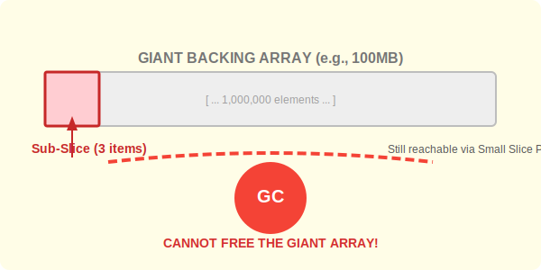

# CH-04: Memory Safety (Reslicing)

> **"A small slice can hold a giant array captive in memory. Understanding pointer retention is the key to preventing memory leaks."**

---

## 1. Tahap 1: Source Alignments & Judul
- **Source Link**: [Go Blog: Slice Tricks & Memory](https://github.com/golang/go/wiki/SliceTricks#memory-leaks)

---

## 2. Tahap 2: Konsep & Esensi

### Definisi ("Apa itu?")
**Memory Safety** dalam konteks Slices berkaitan dengan bagaimana Go mengelola masa hidup (*lifetime*) dari Backing Array. **Reslicing** (mengambil bagian dari slice yang sudah ada) tidak menciptakan salinan data, melainkan hanya menciptakan Header baru yang menunjuk ke array yang sama.

### Rasionalitas ("Why & How?")
- **Efficiency Paradox**: Slicing sangat cepat karena tidak ada penyalinan data. Namun, kelebihan ini bisa menjadi bumerang. Jika Anda memiliki slice berukuran 1 GB dan Anda mengambil 1 KB saja sebagai "hasil akhir", seluruh 1 GB tersebut **tidak akan dihapus** dari memori selama slice 1 KB itu masih digunakan.
- **The Solution (copy)**: Untuk memutus ketergantungan pada backing array yang besar, kita harus menyalin data yang kita butuhkan ke slice baru (fresh array).

### Analogi Model Mental
**Sisa Potongan Pizza**. Bayangkan Anda memesan pizza raksasa seluas 1 meter (Backing Array). Anda hanya ingin memakan satu potong kecil (Sub-slice). Karena aturannya Anda tidak boleh membuang kardus selama masih ada sisa makanan di atasnya, maka kardus pizza seluas 1 meter itu harus tetap ada di meja makan Anda meskipun isinya tinggal satu potong kecil. Meja Anda menjadi penuh sesak (Memory Leak). Solusinya? Pindahkan potongan kecil itu ke piring (New Array) dan buang kardus besarnya.

### Terminologi Teknis
- **Memory Retention**: Kondisi di mana memori tidak bisa dibebaskan oleh GC karena masih ada referensi aktif.
- **Garbage Collection (GC) Reachability**: Algoritma Go yang hanya menghapus memori jika sudah tidak ada pointer yang menunjuk ke sana dari *root set*.

---

## 3. Tahap 3: Visualisasi Sistem

### Memory Retention Scenario

---

## 4. Tahap 4: Mekanisme Pembuktian (GC & Roots)

Apa yang terjadi di level Garbage Collector?
- **Mark & Sweep**: Go menggunakan algoritma *Concurrent Mark-and-Sweep*. GC memindai semua pointer di *stack* dan *global variables* (Roots). Jika sebuah Slice Header masih ada di stack, maka pointer di dalamnya dianggap "Reachability" ke Backing Array-nya.
- **Whole-or-Nothing**: GC tidak bisa menghapus "sebagian" dari sebuah array. Selama ada satu elemen saja yang direferensikan, maka **seluruh blok memori** tersebut dianggap masih dibutuhkan.
- **Technique: `copy()`**: Fungsi `copy(dst, src)` adalah satu-satunya cara aman untuk melakukan isolasi data. Ia memindahkan data fisik ke blok memori baru (`malloc`) dan mengizinkan array lama untuk ditandai sebagai sampah oleh GC.

---

## 5. Tahap 5: Multi-file Lab Praktis (Examples)

Membuktikan kebocoran memori dan menerapkan solusinya.

- **Lab 1**: [01_leak_demo.go](./examples/01_leak_demo.go) - Demonstrasi sederhana bagaimana memori tertahan.
- **Lab 2**: [02_safe_extract.go](./examples/02_safe_extract.go) - Menggunakan `copy()` untuk membebaskan memori besar.

---
*Status: [x] Complete (Gold Standard - PPM V4)*
