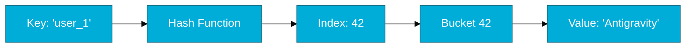

# CH-01: Map Fundamentals

> **"A map is a reference to a hash table. It's fast, convenient, and intentionally unordered."**

---

## 1. Tahap 1: Source Alignments & Judul
- **Source Link**: [Go Spec: Map Types](https://go.dev/ref/spec#Map_types)

---

## 2. Tahap 2: Konsep & Esensi

### Definisi ("Apa itu?")
**Map** adalah struktur data bawaan di Go yang mengimplementasikan *Hash Table*. Ia menyimpan pasangan **Key-Value**, di mana setiap kunci harus unik dan memiliki tipe data yang bisa dibandingkan (*comparable*).

### Rasionalitas ("Why & How?")
- **Fast Lookup**: Map dirancang untuk pencarian data yang sangat cepat (*O(1)* rata-rata). Ini ideal untuk caching, indeks data, atau kamus.
- **Reference Type**: Seperti Slice, Map adalah tipe referensi. Saat Anda mengirim map ke fungsi, fungsi tersebut bekerja pada data asli yang sama.
- **Unordered by Design**: Go secara sengaja melakukan iterasi map dalam urutan yang acak (random) untuk memaksa engineer tidak bergantung pada urutan input.

### Analogi Model Mental
**Loker Gym dengan Label Nama**. Bayangkan sebuah dinding berisi ribuan loker (Memory). Setiap loker punya label nama unik (Key). Anda tidak perlu mencari satu-satu (looping), cukup sebutkan namanya, dan petugas (Hash Function) akan langsung menunjukkan loker mana yang berisi barang Anda (Value).

### Terminologi Teknis
- **Hash Function**: Algoritma yang mengubah Key menjadi angka (index) untuk menentukan lokasi penyimpanan.
- **Zero Value (nil)**: Map yang dideklarasikan tanpa inisialisasi bernilai `nil`. Menambah data ke `nil` map akan menyebabkan **Panic**.

---

## 3. Tahap 3: Visualisasi Sistem

### Map Lookup Workflow

---

## 4. Tahap 4: Mekanisme Pembuktian (The `hmap` Struct)

Apa yang dilakukan Go saat kita membuat Map?
- **Initialization (`makemap`)**: Saat Anda memanggil `make(map[K]V)`, Go Runtime mengalokasikan struktur `hmap` di heap.
- **The nil Map Danger**:
    - `var m map[string]int` -> Nil map. Bisa dibaca (hasilnya zero value), tapi **TIDAK BISA** ditulisi (Panic!).
    - `m := make(map[string]int)` -> Inisialisasi `hmap`. Siap digunakan.
- **Comma OK Idiom**: Karena membaca key yang tidak ada di map akan mengembalikan *zero value* (misal: 0 untuk int), kita butuh cara untuk membedakan "nilai 0 asli" dengan "data tidak ada". Go menggunakan idiom `v, ok := m[key]`.

---

## 5. Tahap 5: Multi-file Lab Praktis (Examples)

Mempraktikkan penggunaan map yang aman dan efisien.

- **Lab 1**: [01_map_crud.go](./examples/01_map_crud.go) - Inisialisasi, tulis, baca, dan hapus.
- **Lab 2**: [02_nil_handling.go](./examples/02_nil_handling.go) - Membuktikan perbedaan perilaku `nil` map vs empty map.

---
*Status: [x] Complete (Gold Standard - PPM V4)*
