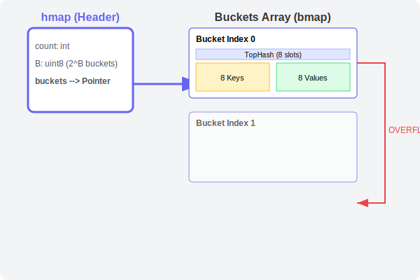

# CH-02: Map Internals (Buckets)

> **"A Go map is not a simple linked list; it's a sophisticated array of buckets designed for speed and cache-friendliness."**

---

## 1. Tahap 1: Source Alignments & Judul
- **Source Link**: [Guts of Maps (Dave Cheney)](https://dave.cheney.net/2018/05/29/how-the-go-runtime-implements-maps-efficiently-without-generics)

---

## 2. Tahap 2: Konsep & Esensi

### Definisi ("Apa itu?")
**Map Internals** merujuk pada struktur data `hmap` dan `bmap` (bucket) yang mengelola penyimpanan fisik key-value di memori. Go menggunakan **Array of Buckets** di mana setiap bucket menampung hingga 8 pasang key-value.

### Rasionalitas ("Why & How?")
- **Cache Locality**: Memasukkan 8 elemen dalam satu bucket membuat CPU tetap berada di level cache L1/L2 saat mencari key, yang jauh lebih cepat daripada melompat-lompat antar pointer memori.
- **Unordered Iteration**: Go secara sengaja memulai iterasi dari bucket yang acak agar engineer tidak bergantung pada urutan. Jika Anda butuh urutan, Anda harus mengurutkan kunci secara manual.
- **Growing & Evacuation**: Saat map terlalu penuh (*load factor* tinggi), Go akan melipatgandakan jumlah bucket dan memindahkan data secara bertahap (*incremental evacuation*).

### Analogi Model Mental
**Lemari Arsip dengan Laci Bersekat**. Bayangkan sebuah lemari arsip (hmap). Setiap laci (Bucket) memiliki tepat 8 sekat untuk map folder (Key-Value). Jika lemari penuh, kita beli lemari baru yang lebih besar dan memindahkan isinya pelan-pelan sambil tetap melayani pengambilan dokumen.

### Terminologi Teknis
- **HOB (High-Order Bits)**: Bagian dari hash yang digunakan untuk mempercepat pencarian di dalam satu bucket.
- **LOB (Low-Order Bits)**: Bagian dari hash yang menentukan index bucket mana yang harus dibuka.

---

## 3. Tahap 3: Visualisasi Sistem

### The Bucket Layout (hmap & bmap)

---

## 4. Tahap 4: Mekanisme Pembuktian (The Lookup Algorithm)

Bagaimana Go menemukan nilai Anda?
1. **Hashing**: Go menghitung hash dari Key.
2. **Bucket Selection**: 
   - Go mengambil beberapa bit terakhir (**LOB**) untuk menentukan index bucket.
3. **Internal Scan**: 
   - Go mengambil beberapa bit awal (**HOB**) dan membandingkannya dengan array `tophash` di dalam bucket.
   - Jika `tophash` cocok, baru Go membandingkan nilai kuncinya secara utuh.
4. **No Reference Return**: Map di Go tidak mengizinkan Anda mengambil *address* dari sebuah elemen (e.g. `&m["key"]` dilarang). Mengapa? Karena saat map tumbuh (*growing*), alamat memori elemen tersebut bisa pindah ke bucket baru.

---

## 5. Tahap 5: Multi-file Lab Praktis (Examples)

Membuktikan sifat internal map yang unik.

- **Lab 1**: [01_map_randomness.go](./examples/01_map_randomness.go) - Membuktikan urutan iterasi berubah setiap kali dijalankan.
- **Lab 2**: [02_address_prohibition.go](./examples/02_address_prohibition.go) - Eksperimen kegagalan mengambil pointer elemen map.

---
*Status: [x] Complete (Gold Standard - PPM V4)*
