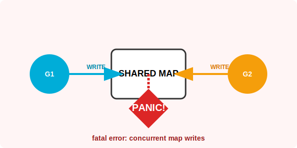

# CH-03: Performance & Safety (Concurrency)

> **"Go maps are NOT thread-safe. A concurrent write to a map causes an unrecoverable crash."**

---

## 1. Tahap 1: Source Alignments & Judul
- **Source Link**: [Go Blog: Go maps in action](https://go.dev/blog/maps#concurrency)

---

## 2. Tahap 2: Konsep & Esensi

### Definisi ("Apa itu?")
**Map Safety** merujuk pada batasan penggunaan Map dalam lingkungan *multi-threaded* (Goroutine). Secara default, Go Map tidak memiliki mekanisme penguncian internal untuk performa. Jika dua goroutine mencoba menulis ke map yang sama secara bersamaan, program akan mengalami **Fatal Crash**.

### Rasionalitas ("Why & How?")
- **Performance First**: Menambahkan *lock* otomatis pada setiap operasi map akan memperlambat 90% kasus penggunaan yang sebenarnya hanya butuh single-thread. Go memilih membebankan keamanan pada engineer.
- **Fail Fast**: Go lebih baik mematikan program secara total daripada membiarkan data di dalam Map rusak (*silent corruption*).
- **`sync.Map` vs `Mutex`**: Go menyediakan `sync.Map` untuk kasus tertentu (high concurrency, stable keys). Namun, untuk kasus umum, membungkus map dengan `sync.RWMutex` adalah pola yang paling direkomendasikan.

### Analogi Model Mental
**Buku Catatan yang Direbutkan**. Bayangkan satu buku catatan (Map). Jika dua orang (Goroutine) mencoba menulis di halaman yang sama secara bersamaan, kertasnya akan sobek (Panic). Solusinya adalah menggunakan **Spidol Penanda** (Mutex). Siapa yang memegang spidol boleh menulis, yang lain harus mengantri.

### Terminologi Teknis
- **Concurrent Map Write**: Kondisi fatal di mana map diakses tulis oleh lebih dari satu thread tanpa koordinasi.
- **Race Condition**: Situasi di mana hasil akhir program bergantung pada urutan eksekusi thread yang tidak terduga.

---

## 3. Tahap 3: Visualisasi Sistem

### Concurrent Map Write Crash

---

## 4. Tahap 4: Mekanisme Pembuktian (Load Factor & sync.Map)

Bagaimana Go menangani performa di balik layar?
- **Load Factor (6.5)**: Go akan memulai *rehash* (perluasan map) jika rata-rata pengisian bucket mencapai 6.5 elemen. Ini adalah angka "ajaib" hasil riset tim Go untuk menyeimbangkan antara penggunaan memori dan kecepatan lookup.
- **sync.Map Internal**: `sync.Map` menggunakan dua map internal: `read` (yang hanya butuh *atomic loading*) dan `dirty` (yang butuh *mutex locking*). Ini sangat cepat jika data jarang berubah (read-heavy), namun lebih lambat daripada map biasa jika data sering ditulis (write-heavy).
- **Deletion**: Menghapus data dari map tidak selalu langsung membebaskan memori backing array. Jika map Anda pernah menampung jutaan data lalu dihapus semua, ia tetap akan memakan RAM yang besar. Solusinya: Buat map baru dan buang map lama.

---

## 5. Tahap 5: Multi-file Lab Praktis (Examples)

Mengenal bahaya konkurensi dan cara mengatasinya.

- **Lab 1**: [01_race_demo.go](./examples/01_race_demo.go) - Demonstrasi crash saat penulisan bersamaan.
- **Lab 2**: [02_safe_map.go](./examples/02_safe_map.go) - Implementasi peta aman menggunakan `sync.RWMutex`.
- **Lab 3**: [03_sync_map.go](./examples/03_sync_map.go) - Penggunaan `sync.Map` bawaan.

---
*Status: [x] Complete (Gold Standard - PPM V4)*
