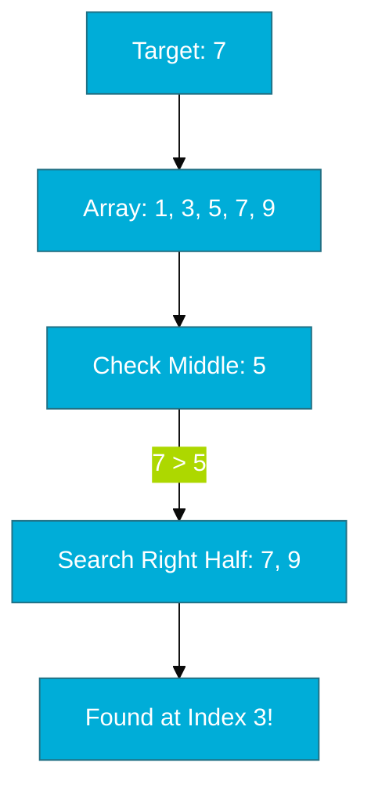

# CH-01: Sorting & Searching

> **"Data is useless if you can't find what you need. Master Go's native sorting and searching for peak efficiency."**

---

## 1. Tahap 1: Source Alignments & Judul
- **Source Link**: [Go Package: slices](https://pkg.go.dev/slices)

---

## 2. Tahap 2: Konsep & Esensi

### Definisi ("Apa itu?")
**Sorting & Searching** adalah operasi dasar untuk menata dan menemukan data dalam koleksi. Go modern (1.21+) menyediakan paket `slices` yang sangat efisien dan berbasis *generics* untuk menangani operasi ini tanpa *overhead* performa dari interface.

### Rasionalitas ("Why & How?")
- **Efficiency**: Mengurutkan data memungkinkan kita menggunakan **Binary Search** yang memiliki kompleksitas waktu *O(log n)*, jauh lebih cepat daripada mencari satu-satu (*Linear Search - O(n)*).
- **In-place Operations**: Mayoritas fungsi sortir di Go bekerja secara *in-place*, artinya mereka langsung mengubah urutan di dalam slice asli tanpa membuat salinan baru (hemat memori).
- **Type Safety**: Dengan *Generics*, kita tidak lagi perlu melakukan *type assertion* yang lambat dan berbahaya saat melakukan pengurutan.

### Analogi Model Mental
**Menata Perpustakaan**. Bayangkan buku-buku yang dilempar sembarangan ke lantai (Unsorted). Jika Anda mencari buku "Go Programming", Anda harus mengecek satu-satu. Jika buku ditata rapi di rak berdasarkan abjad (Sorted), Anda bisa langsung menuju rak huruf "G" dan menemukannya dalam sekejap.

### Terminologi Teknis
- **In-place Sort**: Algoritma yang mengubah urutan data langsung pada memori asalnya.
- **Binary Search**: Algoritma pencarian yang membagi dua area pencarian di setiap langkahnya (syarat: data harus terurut).

---

## 3. Tahap 3: Visualisasi Sistem

### Binary Search Workflow

---

## 4. Tahap 4: Mekanisme Pembuktian (pdqsort & Generics)

Bagaimana Go mengurutkan data dengan sangat cepat?
- **pdqsort (Pattern-defeating Quicksort)**: Algoritma yang digunakan `slices.Sort`. Ia adalah variasi cerdas dari Quicksort yang bisa mendeteksi pola data (misal: data yang sudah hampir terurut) dan beralih ke *Heapsort* atau *Insertion Sort* secara otomatis untuk menghindari performa terburuk (*worst-case*).
- **Comparison Function**: Untuk tipe data kompleks (struct), kita harus memberikan fungsi pembanding (`slices.SortFunc`). Ini dilakukan secara *inline* oleh kompiler sehingga sangat cepat.
- **Why `slices` vs `sort`?**: Paket `sort` lama bergantung pada `sort.Interface`, yang membutuhkan banyak pemanggilan fungsi virtual. Paket `slices` baru menggunakan Generics yang memungkinkan kompiler melakukan *monomorphization* (membuat kode khusus untuk tipe data tersebut), sehingga performanya menyamai kode manual.

---

## 5. Tahap 5: Multi-file Lab Praktis (Examples)

Menerapkan pola sortir dan cari pada berbagai tipe data.

- **Lab 1**: [01_basic_sort.go](./examples/01_basic_sort.go) - Sortir angka dan string.
- **Lab 2**: [02_struct_sort.go](./examples/02_struct_sort.go) - Mengurutkan slice of structs (Objek).
- **Lab 3**: [03_binary_search.go](./examples/03_binary_search.go) - Menggunakan pencarian biner pada data terurut.

---
*Status: [x] Complete (Gold Standard - PPM V4)*
