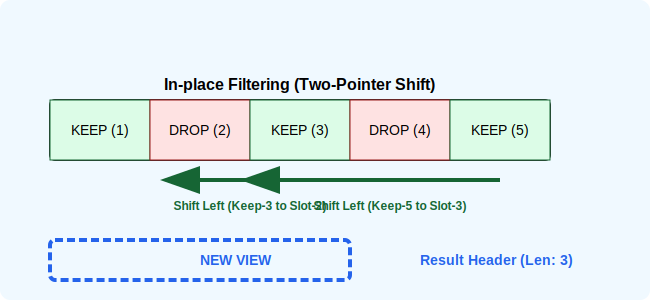

# CH-02: Functional-Style Go

> **"Go isn't a functional language, but with Generics, we can implement powerful data pipelines with near-native performance."**

---

## 1. Tahap 1: Source Alignments & Judul
- **Source Link**: [Go Package: slices (DeleteFunc)](https://pkg.go.dev/slices#DeleteFunc)

---

## 2. Tahap 2: Konsep & Esensi

### Definisi ("Apa itu?")
**Functional-Style Go** merujuk pada pola manipulasi koleksi menggunakan fungsi sebagai argumen (Higher-order functions) untuk melakukan operasi seperti **Filter, Map, dan Reduce**. Sejak Go 1.21, paket `slices` menyediakan fungsi-fungsi ini secara efisien.

### Rasionalitas ("Why & How?")
- **Declarative vs Imperative**: Alih-alih menulis loop `for` yang panjang dengan banyak pernyataan `if`, kita bisa menulis niat kita secara langsung: "Hapus semua elemen yang nilainya kurang dari 10".
- **In-place Efficiency**: Fungsi seperti `slices.DeleteFunc` bekerja secara *in-place*. Ia menggeser elemen di dalam backing array yang sama alih-alih membuat slice baru, yang sangat menghemat memori.
- **Syntactic Sugar**: Membuat kode lebih mudah dibaca dan dipelihara tanpa harus mengorbankan keamanan tipe (*type safety*).

### Analogi Model Mental
**Ban Berjalan (Conveyor Belt) dengan Sensor**. Bayangkan data mengalir di ban berjalan. Sensor (Fungsi Filter) akan mendeteksi barang yang rusak dan langsung menjatuhkannya dari ban. Robot di ujung ban (Fungsi Map) akan mengecat semua barang yang lewat dengan warna baru. Prosesnya mengalir lancar dalam satu jalur.

### Terminologi Teknis
- **Predicate**: Fungsi yang mengembalikan nilai boolean (`true/false`) untuk menentukan apakah suatu elemen memenuhi syarat.
- **Zeroing**: Proses membersihkan referensi pada elemen yang dihapus agar tidak menahan memori (penting untuk slice of pointers).

---

## 3. Tahap 3: Visualisasi Sistem

### In-place Filtering Mechanism (DeleteFunc)

---

## 4. Tahap 4: Mekanisme Pembuktian (Memory Retention & Zeroing)

Apa yang unik dari implementasi fungsional di Go?
- **The `DeleteFunc` Mechanism**: 
   - `slices.DeleteFunc` tidak mengalokasikan memori baru. Ia menggunakan dua indeks: satu untuk membaca dan satu untuk menulis. Ia menimpa elemen yang harus dihapus dengan elemen berikutnya yang valid.
   - Hasilnya adalah slice baru dengan `length` yang lebih kecil, tapi tetap menunjuk ke `capacity` yang sama.
- **Safety First (Zeroing)**: 
   - Saat menghapus elemen dari slice yang berisi pointer, elemen yang "ditinggalkan" di akhir backing array (setelah length mengecil) HARUS di-nol-kan (`nil`). 
   - Jika tidak, pointer tersebut tetap akan menunjuk ke objek di heap, mencegah objek tersebut dibersihkan oleh Garbage Collector. `slices.DeleteFunc` menangani ini secara otomatis untuk Anda.
- **Functional Limitations**: Go tidak mendukung *method chaining* (misal: `s.Filter().Map()`) secara bawaan seperti Java atau JavaScript untuk menjaga kesederhanaan kompilasi. Kita memanggilnya sebagai fungsi independen: `slices.DeleteFunc(s, pred)`.

---

## 5. Tahap 5: Multi-file Lab Praktis (Examples)

Eksperimen dengan transformasi data modern.

- **Lab 1**: [01_filter_data.go](./examples/01_filter_data.go) - Menggunakan `DeleteFunc` untuk menyaring koleksi.
- **Lab 2**: [02_compact_unique.go](./examples/02_compact_unique.go) - Menghilangkan nilai duplikat yang bersebelahan.
- **Lab 3**: [03_pointer_safety.go](./examples/03_pointer_safety.go) - Membuktikan pentingnya pembersihan memori saat menghapus pointer.

---
*Status: [x] Complete (Gold Standard - PPM V4)*
