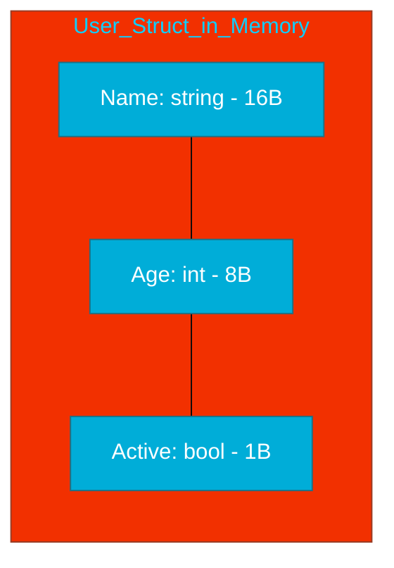

# CH-01: Data Structuring

> **"A struct is a typed collection of fields. It's the primary way to create complex, custom data types in Go."**

---

## 1. Tahap 1: Source Alignments & Judul
- **Source Link**: [Go Spec: Struct Types](https://go.dev/ref/spec#Struct_types)

---

## 2. Tahap 2: Konsep & Esensi

### Definisi ("Apa itu?")
**Struct** adalah tipe data bentukan (*composite type*) yang menggabungkan berbagai field dengan tipe data berbeda ke dalam satu unit logis.

### Rasionalitas ("Why & How?")
- **Grouping**: Memungkinkan kita mengelompokkan data yang saling berhubungan (misal: `User` memiliki `Name` dan `Age`) daripada memisahkan mereka ke dalam variabel independen.
- **Zero Value Guarantee**: Struct yang baru dideklarasikan secara otomatis diisi dengan *zero value* dari tipe data field-nya. Tidak ada data sampah (garbage) di dalam struct Go.
- **Memory Contiguity**: Mirip dengan Array, field di dalam struct disusun secara berurutan di memori, sehingga sangat cepat untuk diakses oleh CPU.

### Analogi Model Mental
**Formulir Fisik**. Bayangkan Anda mengisi formulir pendaftaran. Formulir tersebut memiliki kotak-kotak (Fields) yang sudah ditentukan namanya (Name, Email, Phone). Setiap kotak hanya bisa diisi dengan tipe data tertentu. Struct adalah kertas formulir tersebut.

### Terminologi Teknis
- **Field**: Variabel individual di dalam struct.
- **Struct Tag**: Metadata (string) yang ditempelkan pada field (sering digunakan untuk JSON/Database mapping).
- **Anonymous Struct**: Struct tanpa nama, dideklarasikan langsung saat digunakan (sering untuk pengujian atau data sekali pakai).

---

## 3. Tahap 3: Visualisasi Sistem

### Struct Memory Layout

---

## 4. Tahap 4: Mekanisme Pembuktian (Value Semantics & Alignment)

Bagaimana Go mengelola Struct?
- **Value Semantics**: Secara default, struct adalah *value type*. Jika Anda menyalin struct (`s2 := s1`), Go menyalin seluruh isinya ke alamat memori baru.
- **Exported vs Unexported**: Field yang diawali huruf kapital (e.g. `Name`) dapat diakses dari package lain, sementara huruf kecil (e.g. `age`) bersifat privat.
- **Memory Alignment (Intro)**: Go sesekali menambahkan "ruang kosong" (*padding*) kecil antar field agar akses memori sejajar dengan lebar *word* CPU (biasanya 8 byte). Ini meningkatkan performa akses data.
- **Struct Tags**: Go menggunakan paket `reflect` untuk membaca tag saat runtime (misal: `json:"user_id"`).

---

## 5. Tahap 5: Multi-file Lab Praktis (Examples)

Eksperimen dengan pendefinisian data kompleks.

- **Lab 1**: [01_struct_basics.go](./examples/01_struct_basics.go) - Deklarasi, literal, dan pointer ke struct.
- **Lab 2**: [02_struct_tags.go](./examples/02_struct_tags.go) - Menggunakan tag untuk mapping JSON.
- **Lab 3**: [03_anonymous_struct.go](./examples/03_anonymous_struct.go) - Penggunaan struct sekali pakai.

---
*Status: [x] Complete (Gold Standard - PPM V4)*
