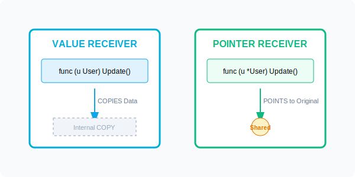

# CH-02: Behavior Attachment (Methods)

> **"Methods are functions with a special receiver argument. They allow you to attach behavior to any type you define."**

---

## 1. Tahap 1: Source Alignments & Judul
- **Source Link**: [Go Spec: Method Declarations](https://go.dev/ref/spec#Method_declarations)

---

## 2. Tahap 2: Konsep & Esensi

### Definisi ("Apa itu?")
**Method** adalah fungsi yang memiliki "penerima" (*receiver*) eksplisit. Receiver ditempatkan di antara kata kunci `func` dan nama fungsi. Method memungkinkan tipe data (biasanya struct) memiliki perilaku tertentu seperti layaknya "objek" dalam bahasa OOP lain.

### Rasionalitas ("Why & How?")
- **Encapsulation**: Mengelompokkan logika operasi langsung di dekat datanya.
- **Interfaces Requirement**: Agar sebuah tipe data bisa memenuhi kontrak (Interface), ia harus memiliki method yang diminta oleh interface tersebut.
- **Cleaner API**: Alih-alih memanggil fungsi global `UpdateUser(u, name)`, kita memanggil `u.Update(name)`. Ini lebih intuitif dan mendukung *autocompletion* di IDE.

### Analogi Model Mental
**Mobil dan Remote Control**. Struct adalah mobilnya (data), dan Method adalah tombol-tombol di remote control-nya. Tombol `BukaPintu()` hanya bekerja khusus untuk mobil tersebut. Tanpa remote (method), mobil tetap ada tapi Anda tidak punya antarmuka yang elegan untuk mengoperasikannya.

### Terminologi Teknis
- **Receiver**: Argumen khusus yang mengasosiasikan fungsi dengan tipe data tertentu.
- **Value Receiver**: Method bekerja pada **salinan** data.
- **Pointer Receiver**: Method bekerja pada **alamat asli** data (bisa mengubah state).
- **Method Set**: Kumpulan method yang dimiliki oleh sebuah tipe data.

---

## 3. Tahap 3: Visualisasi Sistem

### Value vs Pointer Receiver

---

## 4. Tahap 4: Mekanisme Pembuktian (The Method Set & Pointer Magic)

Bagaimana Go menangani method di balik layar?
- **Syntactic Sugar**: `u.Update()` sebenarnya adalah gula sintaksis untuk `User.Update(u)`. Go mengirim receiver sebagai argumen pertama secara implisit.
- **Automatic Dereferencing**: Jika Anda memanggil method pointer pada variabel value (atau sebaliknya), Go akan secara otomatis menangani operator `&` atau `*` untuk Anda. 
    - Contoh: Jika `u` adalah value, `u.UpdatePointer()` otomatis menjadi `(&u).UpdatePointer()`.
- **Method Sets Rule**:
    - Tipe T (Value) hanya memiliki method dengan Value Receiver.
    - Tipe *T (Pointer) memiliki method dengan Value DAN Pointer Receiver.
    - *Ini krusial saat bekerja dengan Interface!*

---

## 5. Tahap 5: Multi-file Lab Praktis (Examples)

Eksperimen dengan behavior attachment.

- **Lab 1**: [01_basic_methods.go](./examples/01_basic_methods.go) - Pendefinisian dan pemanggilan method sederhana.
- **Lab 2**: [02_receiver_impact.go](./examples/02_receiver_impact.go) - Membuktikan perbedaan efek Value vs Pointer Receiver pada state.
- **Lab 3**: [03_non_struct_methods.go](./examples/03_non_struct_methods.go) - Menempelkan method pada tipe data dasar (e.g. `int`, `string`).

---
*Status: [x] Complete (Gold Standard - PPM V4)*
