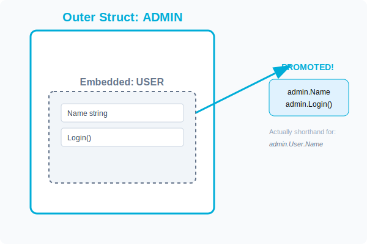

# CH-01: Implicit Promotion (Embedding)

> **"Embedding is not inheritance. It is an automated 'delegation' of fields and methods from one struct to another."**

---

## 1. Tahap 1: Source Alignments & Judul
- **Source Link**: [Go Spec: Anonymous Fields](https://go.dev/ref/spec#Struct_types) (juga dikenal sebagai Embedded Fields)

---

## 2. Tahap 2: Konsep & Esensi

### Definisi ("Apa itu?")
**Embedding** adalah proses menempatkan sebuah tipe data (biasanya struct) ke dalam struct lain tanpa memberikan nama field eksplisit. Go akan secara otomatis "mempromosikan" field dan method dari tipe yang di-embed sehingga seolah-olah milik struct luar.

### Rasionalitas ("Why & How?")
- **Composition over Inheritance**: Go menghindari hirarki kelas yang dalam (`Person -> Employee -> Manager`). Sebagai gantinya, kita membuat struct `Person` dan menanamkannya ke dalam `Employee`.
- **Boilerplate Reduction**: Tanpa promotion, Anda harus menulis `admin.User.Name`. Dengan promotion, Anda cukup menulis `admin.Name`. Kompiler yang melakukan delegasi pemanggilan tersebut.
- **Method Sharing**: Jika `User` punya method `Login()`, maka `Admin` yang menanamkan `User` otomatis punya method `Login()` juga.

### Analogi Model Mental
**Rumah dan Kamar**. Bayangkan sebuah rumah. Di dalam rumah tersebut ada kamar tidur. Anda tidak perlu keluar rumah dulu lalu masuk kembali lewat pintu kamar untuk mengambil bantal. Dari sudut pandang "Rumah", bantal tersebut sudah "tersedia" di dalam lingkup fungsionalitas rumah Anda.

### Terminologi Teknis
- **Embedded Field**: Field struct yang dideklarasikan hanya dengan tipe datanya (tanpa nama).
- **Promotion**: Kemampuan mengakses field/method tipe dalam langsung melalui tipe luar.
- **Shadowing**: Situasi di mana tipe luar memiliki nama field yang sama dengan tipe dalam, sehingga tipe luar "menyembunyikan" field di dalam.

---

## 3. Tahap 3: Visualisasi Sistem

### Field & Method Promotion

---

## 4. Tahap 4: Mekanisme Pembuktian (Resolution Depth & Shadowing)

Bagaimana Go menangani resolusi nama field?
- **Implicit Delegation**: Saat Anda memanggil `admin.Name`, Go pertama-tama mencari di level `Admin`. Jika tidak ada, ia mencari di level `User` (tipe yang di-embed).
- **Shadowing Rule**: Jika `Admin` juga punya field `Name`, maka pemanggilan `admin.Name` akan merujuk ke milik `Admin`. Field milik `User` tetap bisa diakses secara eksplisit melalui `admin.User.Name`.
- **Ambiguity Error**: Jika `Admin` menanamkan dua struct (misal `User` dan `Customer`) dan keduanya punya field `Name`, Go akan memberikan error *ambiguous selector* jika Anda memanggil `admin.Name` tanpa kualifikasi eksplisit.

---

## 5. Tahap 5: Multi-file Lab Praktis (Examples)

Eksperimen dengan mekanisme embedding.

- **Lab 1**: [01_embedding_basics.go](./examples/01_embedding_basics.go) - Dasar embedding dan akses field otomatis.
- **Lab 2**: [02_method_promotion.go](./examples/02_method_promotion.go) - Pembuktian method tipe dalam bisa dipanggil dari tipe luar.
- **Lab 3**: [03_shadowing.go](./examples/03_shadowing.go) - Menangani konflik nama field.

---
*Status: [x] Complete (Gold Standard - PPM V4)*
