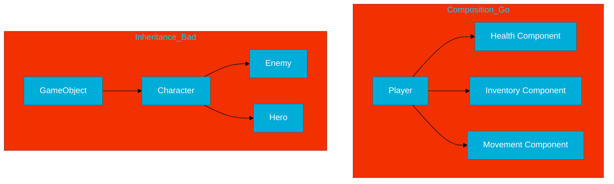

# CH-02: Composition Patterns

> **"Build complex behavior by combining simple, reusable components. Go's lack of inheritance is its greatest strength in design."**

---

## 1. Tahap 1: Source Alignments & Judul
- **Source Link**: [Go Proverbs: Composition](https://go-proverbs.github.io/) ("The bigger the interface, the weaker the abstraction" - relates to how we compose).

---

## 2. Tahap 2: Konsep & Esensi

### Definisi ("Apa itu?")
**Composition Patterns** adalah teknik desain perangkat lunak di mana fungsionalitas objek dibangun dengan menggabungkan (*composing*) objek-objek lain yang lebih kecil dan spesifik, daripada mewarisi sifat dari satu kelas induk raksasa.

### Rasionalitas ("Why & How?")
- **Flexibility**: Dalam *Inheritance*, jika Anda punya kelas `Bird` yang punya method `Fly()`, dan Anda membuat `Ostrich`, Anda terpaksa mewarisi `Fly()` meskipun Burung Unta tidak bisa terbang. Dalam *Composition*, Anda hanya memberikan komponen `Wings` pada burung yang membutuhkannya.
- **Decoupling**: Setiap komponen (struct) berdiri sendiri dan bisa diuji secara independen.
- **Flat Hierarchy**: Go mendorong struktur yang "datar". Tidak ada *Deep Inheritance Tree* yang membingungkan engineer saat menelusuri asal-usul sebuah method.

### Analogi Model Mental
**Lego vs Cetakan Tanah Liat**. Inheritance seperti cetakan tanah liat; sekali Anda mencetak patung, sulit untuk mengubah dasarnya tanpa menghancurkan semuanya. Composition seperti Lego; Anda membangun mobil dari mesin, roda, dan kursi. Ingin jadi perahu? Lepas roda, pasang baling-baling.

### Terminologi Teknis
- **Has-a Relationship**: Hubungan antar objek di mana satu objek *memiliki* objek lain sebagai komponennya.
- **Delegation**: Proses mengalihkan tanggung jawab eksekusi ke komponen internal.
- **Orthogonality**: Desain di mana perubahan pada satu komponen tidak mempengaruhi komponen lain.

---

## 3. Tahap 3: Visualisasi Sistem

### Standard Composition vs Inheritance

---

## 4. Tahap 4: Mekanisme Pembuktian (Component-Based Design)

Bagaimana cara mendesain dengan pola komposisi?
- **Small Structs**: Buat struct yang sangat fokus (misal: hanya mengurusi koordinat `X, Y`).
- **Embedding for Default Behavior**: Gunakan embedding jika Anda ingin mewarisi "implementasi default" secara cepat.
- **Interface for Boundaries**: Gunakan interface (akan dibahas di BK-03) untuk menghubungkan komponen-komponen ini secara longgar (*loose coupling*).
- **The Wrapper Pattern**: Struct luar bertindak sebagai pembungkus yang mengorkestrasi interaksi antar komponen internalnya.

---

## 5. Tahap 5: Multi-file Lab Praktis (Examples)

Membangun sistem modular berbasis komponen.

- **Lab 1**: [01_component_system.go](./examples/01_component_system.go) - Membangun entitas `Player` dari berbagai komponen independen.
- **Lab 2**: [02_behavior_injection.go](./examples/02_behavior_injection.go) - Menyuntikkan perilaku berbeda ke dalam struct yang sama.

---
*Status: [x] Complete (Gold Standard - PPM V4)*
