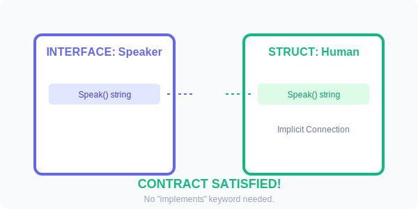

# CH-01: Implicit Fulfillment

> **"If it looks like a duck, swims like a duck, and quacks like a duck, then it probably is a duck. Go's interfaces are pure structural typing."**

---

## 1. Tahap 1: Source Alignments & Judul
- **Source Link**: [Go Spec: Interface Types](https://go.dev/ref/spec#Interface_types)

---

## 2. Tahap 2: Konsep & Esensi

### Definisi ("Apa itu?")
**Interface** di Go adalah tipe data yang hanya mendefinisikan **kumpulan method** (*method set*), tanpa implementasi sama sekali. Sebuah tipe data (struct) dianggap "memenuhi" interface tersebut secara otomatis jika ia memiliki semua method yang diminta.

### Rasionalitas ("Why & How?")
- **Implicit over Explicit**: Di Java, Anda harus menulis `class Dog implements Animal`. Jika library `Animal` dibuat setelah `Dog`, Anda tidak bisa mengubah `Dog`. Di Go, selama `Dog` punya method yang benar, ia otomatis jadi `Animal`. Ini memungkinkan *decoupling* yang sangat kuat.
- **Small Interfaces**: Karena implisit, Go mendorong pembuatan interface yang kecil (seringkali hanya 1 method seperti `io.Reader`). Ini membuat kode sangat modular.
- **Polymorphism**: Interface memungkinkan satu fungsi menerima berbagai tipe data yang berbeda, asalkan mereka memiliki perilaku yang sama.

### Analogi Model Mental
**Soket USB**. Komputer Anda (Interface) menyediakan soket USB yang menerima perangkat apa pun yang punya konektor sesuai standar USB (Method). Komputer tidak peduli apakah perangkat itu Mouse, Flashdisk, atau Kipas Angin. Selama konektornya pas, data bisa mengalir.

### Terminologi Teknis
- **Satisfying an Interface**: Kondisi di mana sebuah tipe memiliki semua method yang didefinisikan dalam interface.
- **Duck Typing**: Gaya pengetikan di mana kehadiran method menentukan kecocokan tipe, bukan deklarasi eksplisit.
- **Contract Fulfillment**: Proses penjaminan bahwa sebuah objek mematuhi janji (method) yang ditawarkan interface.

---

## 3. Tahap 3: Visualisasi Sistem

### Interface Satisfaction (Structural Typing)

---

## 4. Tahap 4: Mekanisme Pembuktian (Method Sets & Pointers)

Bagaimana Go menjamin kepatuhan kontrak?
- **Static Checking**: Kompiler akan memeriksa saat Anda memasukkan struct ke dalam variabel interface. Jika ada satu method saja yang kurang, kode tidak akan bisa di-compile.
- **Value vs Pointer Receiver Logic**: 
    - Penting: Jika sebuah tipe mengimplementasikan method interface menggunakan **Pointer Receiver**, maka hanya **Pointer** tipe tersebut yang memenuhi interface.
    - Mengapa? Karena pointer bisa mengakses method value, tapi value tidak selalu bisa mengakses method pointer secara aman dalam konteks interface.
- **The internal `iface` struct**: Di runtime, variabel interface sebenarnya adalah struct dengan dua pointer: satu ke informasi tipe (`itab`) dan satu ke data aslinya.

---

## 5. Tahap 5: Multi-file Lab Praktis (Examples)

Membangun dan memenuhi kontrak implisit.

- **Lab 1**: [01_interface_basics.go](./examples/01_interface_basics.go) - Definisi interface dan pemenuhan oleh dua struct berbeda.
- **Lab 2**: [02_polymorphism.go](./examples/02_polymorphism.go) - Fungsi yang menerima interface sebagai argumen generic.
- **Lab 3**: [03_pointer_fulfillment.go](./examples/03_pointer_fulfillment.go) - Membedakan kapan harus mengirim pointer vs value ke interface.

---
*Status: [x] Complete (Gold Standard - PPM V4)*
