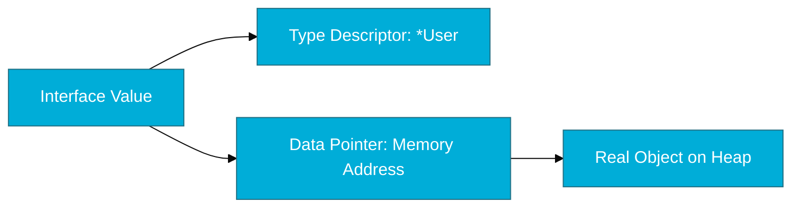

# CH-02: Type Dynamics (Assertion & Switch)

> **"Interface values are dynamic containers. Type dynamics allow us to peek inside the container and retrieve the original type safely."**

---

## 1. Tahap 1: Source Alignments & Judul
- **Source Link**: [Go Spec: Type Assertions](https://go.dev/ref/spec#Type_assertions)

---

## 2. Tahap 2: Konsep & Esensi

### Definisi ("Apa itu?")
**Type Dynamics** merujuk pada kemampuan Go untuk memeriksa tipe data asli yang tersimpan di dalam sebuah variabel interface saat program berjalan (*runtime*). Dua teknik utamanya adalah **Type Assertion** (untuk tipe tunggal) dan **Type Switch** (untuk cabang multi-tipe).

### Rasionalitas ("Why & How?")
- **Safe Extraction**: Interface menyembunyikan detail tipe. Untuk mengakses method spesifik struct yang tidak ada di interface, kita butuh "mengekstrak" kembali tipe aslinya.
- **Dynamic Dispatch**: Memungkinkan logika yang berbeda berdasarkan tipe data yang masuk tanpa harus menggunakan *Generic* (yang baru ada di Go 1.18).
- **The Empty Interface (`any`)**: Tipe `interface{}` (atau alias `any`) tidak memiliki method, sehingga **semua** tipe data di Go memenuhinya. Ini berguna untuk fungsi yang menerima "apa saja", namun membutuhkan Type Switch untuk memproses datanya.

### Analogi Model Mental
**Kotak Hadiah Tertutup**. Interface adalah kotak hadiah. Anda tahu ada "sesuatu" di dalamnya, tapi Anda tidak tahu apakah itu jam tangan atau parfum sampai Anda membukanya (Type Assertion). Jika Anda punya banyak kotak, Anda bisa memisahkannya ke rak yang berbeda berdasarkan isinya (Type Switch).

### Terminologi Teknis
- **Type Assertion**: Sintaks `x.(T)` yang mencoba mengubah interface `x` menjadi tipe `T`.
- **Comma OK Idiom**: Pola `v, ok := x.(T)` untuk mencegah panic jika tipe tidak cocok.
- **Type Switch**: Konstruksi `switch x.(type)` yang mirip dengan switch-case biasa tapi bekerja pada tipe data.

---

## 3. Tahap 3: Visualisasi Sistem

### Interface Value Anatomy

---

## 4. Tahap 4: Mekanisme Pembuktian (Safety & any)

Bagaimana cara melakukan inspeksi tipe dengan aman?
- **Avoid Panic**: Jangan pernah gunakan `v := i.(T)` secara langsung kecuali Anda 100% yakin. Selalu gunakan `v, ok := i.(T)`. Jika `ok` bernilai `false`, program tidak akan crash.
- **The `any` Alias**: Sejak Go 1.18, `any` hanyalah nama lain untuk `interface{}`. Gunakan `any` agar kode lebih bersih, tapi jangan berlebihan karena akan menghilangkan keamanan tipe statis (*static type safety*).
- **Performance**: Type assertion melibatkan pemeriksaan runtime, yang sedikit lebih lambat daripada pemanggilan fungsi biasa. Gunakan secukupnya di jalur kritis (*hot path*).

---

## 5. Tahap 5: Multi-file Lab Praktis (Examples)

Mengekstrak tipe dari interface dengan aman.

- **Lab 1**: [01_type_assertion.go](./examples/01_type_assertion.go) - Menggunakan pola comma-ok.
- **Lab 2**: [02_type_switch.go](./examples/02_type_switch.go) - Menangani berbagai tipe dalam satu fungsi.
- **Lab 3**: [03_empty_interface.go](./examples/03_empty_interface.go) - Penggunaan `any` untuk fleksibilitas maksimal.

---
*Status: [x] Complete (Gold Standard - PPM V4)*
