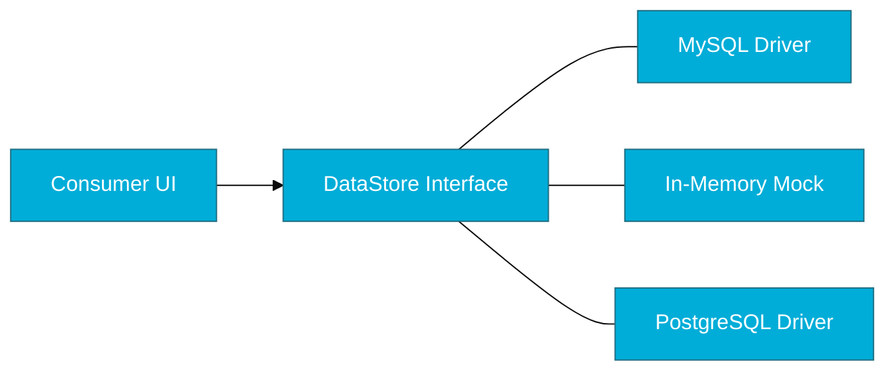

# CH-03: Interface Patterns

> **"Accept interfaces, return structs. This Go proverb is the key to creating flexible, yet concrete APIs."**

---

## 1. Tahap 1: Source Alignments & Judul
- **Source Link**: [Go Proverbs](https://go-proverbs.github.io/)

---

## 2. Tahap 2: Konsep & Esensi

### Definisi ("Apa itu?")
**Interface Patterns** adalah kumpulan praktik terbaik (*best practices*) dalam menggunakan interface untuk mencapai fleksibilitas dan keterlepasan (*decoupling*) antar komponen dalam sistem Go.

### Rasionalitas ("Why & How?")
- **Accept Interfaces, Return Structs**: Ini adalah aturan emas di Go. Fungsi harus menerima argumen berupa interface agar bisa bekerja dengan berbagai implementasi, tetapi harus mengembalikan tipe data konkrit (struct) agar pengguna fungsi tahu persis data apa yang mereka dapatkan tanpa perlu melakukan *type assertion*.
- **Decoupling Producer & Consumer**: Dengan interface, kode yang menggunakan data (Consumer) tidak perlu tahu siapa yang membuat data tersebut (Producer). Mereka hanya peduli pada kontraknya.
- **Testability (Mocking)**: Interface memungkinkan kita mengganti komponen asli (misal: Database beneran) dengan komponen palsu (Mock) saat pengujian unit, sehingga tes berjalan cepat dan tanpa efek samping.

### Analogi Model Mental
**Sistem Hiburan Rumah**. Layar TV Anda (Consumer) memiliki input HDMI (Interface). Ia tidak peduli apakah yang mengirim sinyal video adalah DVD Player, Playstation, atau Laptop (Producers). Selama perangkat tersebut punya output HDMI, TV bisa menampilkan gambarnya.

### Terminologi Teknis
- **Interface Pollution**: Kesalahan desain di mana setiap struct dibuatkan interface-nya secara prematur (berlebihan).
- **Mocking**: Teknik pengujian dengan membuat implementasi interface "palsu" untuk mengisolasi unit yang diuji.
- **Producer vs Consumer**: Peran sebuah kode dalam hubungannya dengan data dan kontrak interface.

---

## 3. Tahap 3: Visualisasi Sistem

### Decoupling via Interface

---

## 4. Tahap 4: Mekanisme Pembuktian (The Power of Single-Method Interfaces)

Mengapa interface kecil lebih baik?
- **High Composability**: Interface seperti `io.Reader` (hanya punya satu method `Read`) bisa diimplementasikan oleh file, koneksi network, string buffer, hingga dekompresor ZIP. Semuanya bisa saling dipertukarkan.
- **Ad-hoc Definition**: Di Go, interface sering didefinisikan oleh **pengguna** (Consumer), bukan pembuat (Producer). Jika sebuah fungsi hanya butuh menyimpan data, ia mendefinisikan `Writer` interface sendiri yang berisi method `Write()`.
- **Mocking Efficiency**: Semakin kecil interface, semakin mudah bagi Anda untuk membuat object Mock untuk keperluan pengujian.

---

## 5. Tahap 5: Multi-file Lab Praktis (Examples)

Menerapkan pola desain interface yang elegan.

- **Lab 1**: [01_decoupling.go](./examples/01_decoupling.go) - Memisahkan logika bisnis dari detail penyimpanan data.
- **Lab 2**: [02_mocking_demo.go](./examples/02_mocking_demo.go) - Menggunakan interface untuk melakukan unit testing tanpa database asli.

---
*Status: [x] Complete (Gold Standard - PPM V4)*
