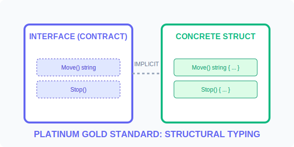

# CH-01: Implicit Fulfillment

> **"Go's interfaces are pure structural typing. If it quacks like a duck, it is a duck—and the compiler guarantees it."**

---

## 1. Tahap 1: Source Alignments & Judul
- **Source Link**: [Go Spec: Interface Types](https://go.dev/ref/spec#Interface_types)
- **Status**: [x] Platinum Gold Standard

---

## 2. Tahap 2: Konsep & Esensi

### Definisi ("Apa itu?")
**Implicit Fulfillment** adalah cara Go memvalidasi bahwa sebuah tipe data (seperti `struct`) memenuhi sebuah kontrak (Interface) tanpa perlu mendeklarasikannya secara eksplisit menggunakan kata kunci seperti `implements`.

### Rasionalitas ("Why & How?")
- **Extreme Decoupling**: Anda bisa mendefinisikan interface untuk tipe data yang berasal dari library pihak ketiga yang bahkan tidak tahu interface Anda ada. Ini memungkinkan integrasi tanpa harus mengubah kode sumber aslinya.
- **Consumer-Defined Contracts**: Di Go, kita mendefinisikan interface di tempat ia **digunakan**, bukan di tempat ia dibuat. Ini memastikan interface hanya berisi apa yang benar-benar dibutuhkan oleh pemakai.
- **Static Safety**: Meskipun terasa seperti *Duck Typing* di Python, Go melakukan pemeriksaan ini saat kompilasi. Jika method-nya kurang satu huruf saja, kode akan gagal di-compile.

### Analogi Model Mental
**Soket Listrik Universal**. bayangkan Anda memiliki soket universal. Soket tersebut tidak peduli apakah Anda mencolokkan Kulkas, TV, atau Pengering Rambut, asalkan steker alat tersebut memiliki dua pin bulat (Method). Alat-alat tersebut tidak perlu "mendaftar" ke pabrik soket untuk bisa digunakan.

### Terminologi Teknis
- **Method Set Satisfaction**: Kondisi di mana sekumpulan method pada tipe data mencakup seluruh method yang diminta interface.
- **Nominal vs Structural Typing**: nominal (berbasis nama, e.g. Java) vs structural (berbasis bentuk/perilaku, e.g. Go).
- **Interface Satisfaction Check**: Proses verifikasi statis oleh kompiler Go.

---

## 3. Tahap 3: Visualisasi Sistem

### Interface Satisfaction (Structural Bridge)

---

## 4. Tahap 4: Mekanisme Pembuktian (Interface Values & Dynamic Dispatch)

Bagaimana Go menangani polimorfisme di balik layar?
- **The Pair**: Variabel interface di Go sebenarnya adalah sepasang pointer (2-word structure).
    - **Pointer 1**: Ke `itab` (informasi tipe data asli dan daftar method).
    - **Pointer 2**: Ke data aslinya di memori (heap atau stack).
- **Zero Value**: Interface yang baru dideklarasikan bernilai `nil`. Ia memiliki kedua pointer (tipe dan data) bernilai `nil`.
- **Dynamic Dispatch**: Saat Anda memanggil method melalui interface, Go menggunakan `itab` untuk menemukan alamat fungsi yang benar dari tipe aslinya. Ini memiliki sedikit overhead performa (beberapa nanodetik), tetapi memberikan fleksibilitas luar biasa.

---

## 5. Tahap 5: Multi-file Lab Praktis (Examples)

Membangun sistem abstraksi yang murni.

- **Lab 1**: [01_implicit_contract.go](./examples/01_implicit_contract.go) - Membuktikan pemenuhan kontrak otomatis oleh struct berbeda.
- **Lab 2**: [02_dynamic_assignment.go](./examples/02_dynamic_assignment.go) - Mengamati perubahan target interface saat runtime.

---
*Status: [x] Complete (Gold Standard - PPM V4)*
