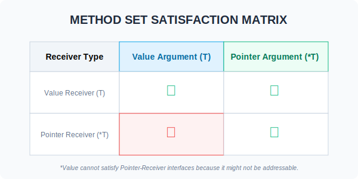

# CH-02: Method Set Rule

> **"A pointer to a type includes all methods of that type, but a value only includes methods with a value receiver. This is the golden rule of interface satisfaction."**

---

## 1. Tahap 1: Source Alignments & Judul
- **Source Link**: [Go Spec: Method Sets](https://go.dev/ref/spec#Method_sets)
- **Status**: [x] Platinum Gold Standard

---

## 2. Tahap 2: Konsep & Esensi

### Definisi ("Apa itu?")
**Method Set Rule** adalah aturan yang menentukan kumpulan method mana yang dikaitkan dengan sebuah tipe data (apakah itu tipe dasar `T` atau tipe pointernya `*T`). Kumpulan ini menentukan apakah tipe tersebut memenuhi sebuah Interface atau tidak.

### Rasionalitas ("Why & How?")
- **Addressability**: Go sangat mementingkan keamanan memori. Sebuah *Value* tidak selalu memiliki alamat memori yang bisa dimodifikasi (misal: hasil return fungsi). Jika method membutuhkan pointer untuk mengubah data, Go tidak bisa menjamin keamanan jika ia mencoba memanggilnya dari value yang tidak memiliki alamat pasti.
- **Explicit vs Implicit**: Saat memanggil method biasa `u.Update()`, Go melakukan konversi otomatis. Namun, saat memasukkan objek ke **Interface**, Go sangat ketat. Tipe data harus benar-benar MEMILIKI method tersebut dalam set-nya.
- **Integrity**: Aturan ini memastikan bahwa jika sebuah interface menjanjikan perubahan state (via pointer), maka yang masuk ke interface tersebut HARUSlah sebuah alamat memori yang valid (pointer).

### Analogi Model Mental
**Dokumen Asli vs Fotokopi**.
- Jika method Anda hanya **Membaca** (Value Receiver), Anda bisa melakukannya di dokumen asli maupun di fotokopinya.
- Jika method Anda harus **Menandatangani/Mengubah** (Pointer Receiver), Anda HARUS melakukannya di dokumen ASLI. Anda tidak bisa menandatangani fotokopi dan berharap dokumen aslinya ikut berubah. Interface menuntut kepastian bahwa yang Anda berikan adalah "Dokumen Asli" jika Anda ingin menandatanganinya.

### Terminologi Teknis
- **Method Set**: Daftar method yang 'menempel' pada sebuah tipe.
- **T (Value Type)**: Set-nya hanya berisi method dengan Value Receiver.
- **\*T (Pointer Type)**: Set-nya berisi method dengan Value Receiver DAN Pointer Receiver.

---

## 3. Tahap 3: Visualisasi Sistem

### Satisfaction Matrix

---

## 4. Tahap 4: Mekanisme Pembuktian (Interface Value Integrity)

Apa yang terjadi jika kita melanggar aturan ini?
- **Compile Error**: Anda akan mendapatkan error seperti `cannot use u (type User) as Speaker... Speak method has pointer receiver`.
- **The Why**: Karena interface menyimpan salinan data. Jika data tersebut berupa value, dan Anda memanggil method pointer, method tersebut akan mengubah salinan di dalam interface, bukan data aslinya. Go menganggap pola ini membingungkan dan berbahaya, sehingga dilarang di level kompilasi.
- **Consistency**: Aturan ini menjaga agar perilaku polimorfisme di Go tetap konsisten dan terprediksi tanpa ada "side effect" tersembunyi.

---

## 5. Tahap 5: Multi-file Lab Praktis (Examples)

Membuktikan aturan Method Set secara praktis.

- **Lab 1**: [01_value_satisfaction.go](./examples/01_value_satisfaction.go) - Demo kegagalan value memenuhi pointer interface.
- **Lab 2**: [02_pointer_satisfaction.go](./examples/02_pointer_satisfaction.go) - Demo sukses pointer memenuhi kedua jenis receiver.

---
*Status: [x] Complete (Gold Standard - PPM V4)*
