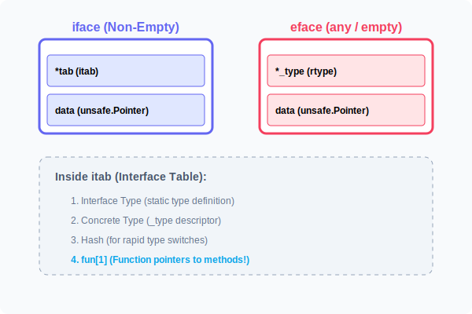

# CH-01: Internal Structure (iface & eface)

> **"An interface variable is not just a pointer. It's a header consisting of two words that describe the type and the data."**

---

## 1. Tahap 1: Source Alignments & Judul
- **Source Link**: [Go Runtime: runtime2.go](https://github.com/golang/go/blob/master/src/runtime/runtime2.go) (Search for `iface` and `eface`)
- **Status**: [x] Platinum Gold Standard

---

## 2. Tahap 2: Konsep & Esensi

### Definisi ("Apa itu?")
**Internal Structure** merujuk pada representasi fisik variabel interface di memori selama runtime. Go membedakan antara interface yang memiliki method (`iface`) dan interface kosong (`eface` atau `any`).

### Rasionalitas ("Why & How?")
- **Performance**: Dengan menyimpan informasi tipe data (`itab` atau `_type`) di samping datanya, Go bisa melakukan pemeriksaan tipe dan pemanggilan method secara efisien tanpa harus menebak-nebak isi memori.
- **Dynamic Equality**: Aturan perbandingan interface (e.g. `iface1 == iface2`) bergantung pada kecocokan kedua komponen: tipe dan data. Inilah sebabnya mengapa interface dengan tipe konkrit `nil` tetapi tipe descriptor-nya tetap ada, tidak sama dengan interface `nil` murni.
- **Safety**: Header ini mencegah program mengakses memori secara ilegal karena setiap akses melalui interface divalidasi oleh informasi tipe di dalamnya.

### Analogi Model Mental
**Label Harga di Barang**.
- **eface**: Ibarat barang yang hanya punya label deskripsi (Tipe). Anda tahu itu "Botol", tapi tidak bisa melakukan apa-apa selain melihatnya.
- **iface**: Ibarat barang dengan label deskripsi (Tipe) DAN buku instruksi (itab). Anda tahu itu "Botol" (Tipe) dan Anda tahu cara "Memutar Tutupnya" (Method).

### Terminologi Teknis
- **Word**: Satuan unit memori (biasanya 8 byte di 64-bit system). Interface selalu berukuran 2 word (16 byte).
- **itab**: Interface Table yang menyimpan pemetaan antara method interface dan implementasi struct asli.
- **Dynamic Dispatch**: Proses mencari fungsi yang tepat dari `itab` saat runtime.

---

## 3. Tahap 3: Visualisasi Sistem

### Runtime Layout (iface vs eface)

---

## 4. Tahap 4: Mekanisme Pembuktian (The 'Nil' Interface Trap)

Jebakan paling umum untuk Senior Engineer di Go:
- **Typed Nil**: Sebuah interface tidak dianggap `nil` jika ia memiliki informasi tipe, meskipun data aslinya adalah pointer `nil`.
- **Contoh**: Jika Anda memasukkan `*User(nil)` ke dalam interface `Speaker`, maka `interface == nil` akan bernilai `FALSE`.
- **Reason**: Karena komponen pertama (itab/type) berisi `*User`, bukan `nil`. Hanya interface yang kedua komponennya (type AND data) bernilai `nil` yang dianggap benar-benar `nil`.

---

## 5. Tahap 5: Multi-file Lab Praktis (Examples)

Mengintip rahasia memori interface.

- **Lab 1**: [01_interface_size.go](./examples/01_interface_size.go) - Membuktikan ukuran interface selalu 2 word.
- **Lab 2**: [02_nil_trap.go](./examples/02_nil_trap.go) - Eksperimen dengan 'Typed Nil' yang sering membingungkan.

---
*Status: [x] Complete (Gold Standard - PPM V4)*
