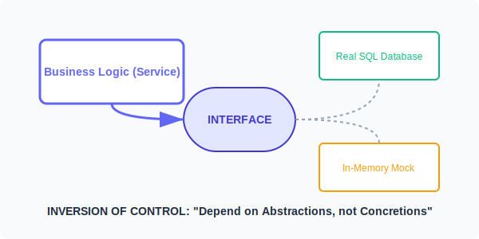

# CH-01: Mocking & Decoupling

> **"If a function accepts a concrete type, it's tied to that type forever. If it accepts an interface, it's open to the world."**

---

## 1. Tahap 1: Source Alignments & Judul
- **Source Link**: [Go Blog: Laws of Reflection](https://go.dev/blog/laws-of-reflection) (Context on interfaces)
- **Status**: [x] Platinum Gold Standard

---

## 2. Tahap 2: Konsep & Esensi

### Definisi ("Apa itu?")
**Decoupling** adalah teknik memutus ketergantungan langsung antar komponen dengan menyisipkan Interface sebagai jembatan. **Mocking** adalah turunan dari teknik ini yang memungkinkan kita membuat objek "palsu" untuk mensimulasikan komponen berat (seperti Database atau API eksternal) saat melakukan pengujian unit.

### Rasionalitas ("Why & How?")
- **Speed of Testing**: Menjalankan tes dengan database asli bisa memakan waktu detik hingga menit. Dengan Mock (In-Memory), tes selesai dalam milidetik.
- **Reliability**: Tes Anda tidak akan gagal hanya karena internet mati atau database sedang maintenance, karena semuanya dikendalikan secara lokal melalui interface.
- **Dependency Inversion**: Alih-alih Logika Bisnis yang bergantung pada Database (High-level depends on Low-level), keduanya sekarang bergantung pada Interface yang sama. Kontrol dibalik (*Inversion of Control*).

### Analogi Model Mental
**Soket Lampu**. Tukang listrik memasang kabel ke soket (Interface). Dia tidak peduli apakah nanti Anda memasang bohlam LED, bohlam pijar, atau speaker bluetooth berbentuk bohlam. Dia bisa mengetes aliran listrik ("Testing") hanya dengan menggunakan alat ukur sederhana tanpa perlu bohlam asli yang mahal.

### Terminologi Teknis
- **IoC (Inversion of Control)**: Prinsip desain di mana alur kontrol program dibalik.
- **Mock Object**: Implementasi interface yang perilakunya diprogram untuk kebutuhan tes.
- **Dependency Injection**: Pola memasukkan objek (implementasi interface) ke dalam struct lain.

---

## 3. Tahap 3: Visualisasi Sistem

### Dependency Inversion Bridge

---

## 4. Tahap 4: Mekanisme Pembuktian (Consumer-Defined Interfaces)

Kunci sukses decoupling di Go:
- **Define as Consumer**: Jangan buat interface di package `database`. Buatlah interface di package `service` (penggunanya). Mengapa? Karena `service` tahu persis method apa yang ia butuhkan.
- **Small Interfaces**: Gunakan interface sekecil mungkin (1-3 method). Ini membuat proses Mocking menjadi sangat mudah dan tidak merepotkan.
- **Accept Interfaces, Return Structs**: Fungsi Anda harus menerima interface sebagai argumen (agar bisa di-mock), tetapi mengembalikan struct konkrit (agar pemakai fungsi mendapatkan data yang jelas).

---

## 5. Tahap 5: Multi-file Lab Praktis (Examples)

Membangun arsitektur yang testable.

- **Lab 1**: [01_database_decoupling.go](./examples/01_database_decoupling.go) - Memisahkan logika aplikasi dari detail SQL.
- **Lab 2**: [02_unit_testing_mock.go](./examples/02_unit_testing_mock.go) - Simulasi pengujian murni tanpa efek samping.

---
*Status: [x] Complete (Gold Standard - PPM V4)*
