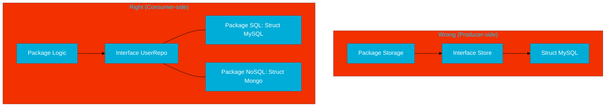

# CH-02: Design Safety (Pollution & Placement)

> **"Interface pollution is the act of creating interfaces without a clear, immediate need. Redundant interfaces lead to more code, not more flexibility."**

---

## 1. Tahap 1: Source Alignments & Judul
- **Source Link**: [Go Proverbs](https://go-proverbs.github.io/) ("The bigger the interface, the weaker the abstraction.")
- **Status**: [x] Platinum Gold Standard

---

## 2. Tahap 2: Konsep & Esensi

### Definisi ("Apa itu?")
**Design Safety** dalam konteks interface adalah praktik memastikan bahwa interface hanya digunakan saat benar-benar dibutuhkan. Dua konsep utamanya adalah menghindari **Interface Pollution** (membuat interface untuk setiap struct) dan menerapkan **Consumer-side Placement** (mendefinisikan interface di tempat ia digunakan).

### Rasionalitas ("Why & How?")
- **Lean Design**: Setiap interface yang Anda tambahkan menambah beban kognitif pada pembaca kode. Jika sebuah struct hanya memiliki satu implementasi dan tidak ada rencana untuk di-mock, maka interface tidak diperlukan.
- **Extreme Flexibility**: Dengan mendefinisikan interface di sisi Consumer (pemakai), package Anda tidak bergantung pada package penyedia (Producer). Ini memungkinkan "Plug-and-Play" yang murni.
- **Maintenance**: Interface yang terlalu besar sulit untuk dipenuhi oleh tipe lain. Interface kecil (1-2 method) jauh lebih mudah dipelihara dan digunakan kembali.

### Analogi Model Mental
**Suku Cadang Mobil**.
- **Pollution**: Bayangkan jika setiap sekrup di mobil Anda harus memiliki "Sertifikat Standar Sekrup" (Interface) yang berbeda-beda. Ini akan membuat perbaikan mobil menjadi sangat birokratis dan lambat.
- **Safety**: Kita hanya membuat standar (Interface) untuk bagian-bagian yang memang sering diganti, seperti Ban atau Aki. Anda tidak perlu standar untuk Dashboard jika Dashboard tersebut tidak pernah direncanakan untuk diganti dengan merek lain.

### Terminologi Teknis
- **Interface Pollution**: Over-abstraction yang menyebabkan kode sulit dilacak.
- **Consumer-side Interface**: Pola di mana package yang membutuhkan fungsionalitas mendefinisikan kontraknya sendiri.
- **Abstraction Leak**: Kesalahan di mana detail implementasi bocor ke dalam definisi interface.

---

## 3. Tahap 3: Visualisasi Sistem

### Placement: Producer vs Consumer

---

## 4. Tahap 4: Mekanisme Pembuktian (Small vs Big Interfaces)

Kapan harus berhenti membuat interface?
- **The Rule of Three**: Jika Anda belum memiliki setidaknya 2 atau 3 implementasi berbeda (termasuk Mock), tanyakan pada diri sendiri: "Apakah interface ini benar-benar diperlukan sekarang?".
- **The IO Example**: Interface paling sukses di Go adalah `io.Reader` dan `io.Writer`. Keduanya hanya memiliki SATU method. Kesederhanaan inilah yang membuatnya bisa digunakan di ribuan package berbeda.
- **Explicit Check**: Jika Anda ingin memastikan sebuah struct benar-benar memenuhi interface di level kompilasi, gunakan trik: `var _ MyInterface = (*MyStruct)(nil)`. Ini adalah pengaman tanpa overhead runtime.

---

## 5. Tahap 5: Multi-file Lab Praktis (Examples)

Mendeteksi dan memperbaiki desain interface.

- **Lab 1**: [01_interface_pollution.go](./examples/01_interface_pollution.go) - Contoh desain yang terlalu rumit dan tidak perlu.
- **Lab 2**: [02_consumer_placement.go](./examples/02_consumer_placement.go) - Refactoring ke arah desain yang lurus dan idiomatis Go.

---
*Status: [x] Complete (Gold Standard - PPM V4)*
