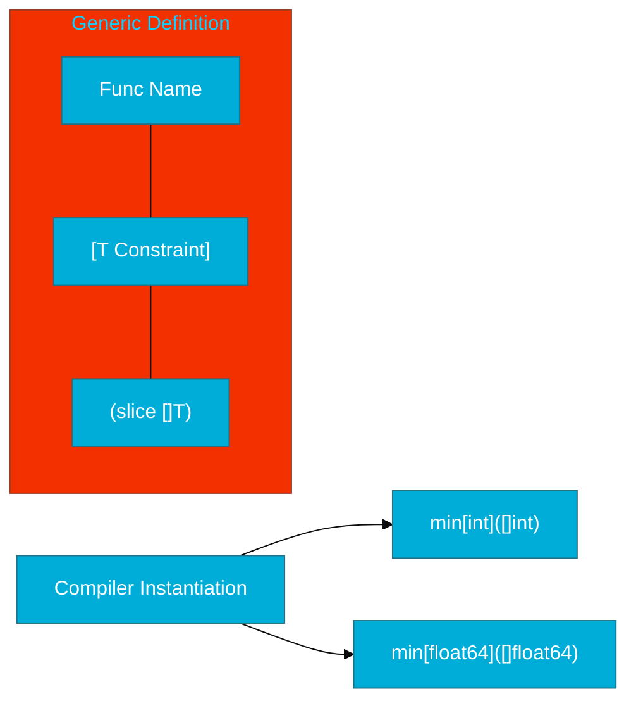

# CH-01: Constraints & Type Parameters

> **"Type parameters turn functions into templates for types, while constraints ensure those types behave as expected."**

---

## 1. Tahap 1: Source Alignments & Judul
- **Source Link**: [Go Blog: An Introduction to Generics](https://go.dev/blog/intro-generics)
- **Status**: [x] Platinum Gold Standard

---

## 2. Tahap 2: Konsep & Esensi

### Definisi ("Apa itu?")
**Generics** adalah kemampuan untuk menulis kode (fungsi atau struct) yang dapat bekerja dengan berbagai tipe data tanpa mengorbankan pemeriksaan tipe (*Type Safety*) saat kompilasi. Ini dicapai melalui **Type Parameters** (tipe yang diparameterisasi) dan **Constraints** (batasan tipe apa saja yang diizinkan).

### Rasionalitas ("Why & How?")
- **DRY (Don't Repeat Yourself)**: Dulu, jika Anda ingin mencari nilai terkecil di slice `int` dan slice `float64`, Anda butuh dua fungsi berbeda. Dengan Generics, satu fungsi cukup untuk keduanya.
- **Type Safety over `any`**: Menggunakan `interface{}` (any) mengharuskan kita melakukan *Type Assertion* yang berisiko panic. Generics memastikan tipe data benar sejak di kompilasi.
- **Performance**: Berbeda dengan interface yang menggunakan *Dynamic Dispatch* dan alokasi heap, Generics di Go menggunakan teknik *Monomorphization* (secara teori) atau *GCShape Stenciling* yang lebih efisien dalam banyak kasus.

### Analogi Model Mental
**Cetakan Kue (Template)**.
- Tanpa Generics: Anda punya cetakan besi untuk kue cokelat dan cetakan plastik untuk kue keju.
- Dengan Generics: Anda punya satu "Cetakan Universal" (Generic function) yang bisa menerima adonan apa saja (Type Parameter), asalkan adonan tersebut "Bisa Dipanggang" (Constraint).

### Terminologi Teknis
- **Type Parameter**: Simbol penampung tipe, biasanya ditulis `[T any]`.
- **Constraint**: Interface yang mendefinisikan batas tipe, misal `comparable` (tipe yang bisa dibandingkan dengan `==`).
- **Instantiation**: Proses di mana compiler mengganti `T` dengan tipe konkrit (misal `int`) saat fungsi dipanggil.

---

## 3. Tahap 3: Visualisasi Sistem

### Generic Function Anatomy

---

## 4. Tahap 4: Mekanisme Pembuktian (Constraint Satisfiability)

Bagaimana cara membatasi tipe data agar kode tidak rusak?
- **The `any` Constraint**: Alias dari `interface{}`. Digunakan jika kita tidak melakukan operasi apapun pada data tersebut (misal hanya memindahkan data).
- **The `comparable` Constraint**: Bawaan Go. Menjamin tipe data bisa dibandingkan menggunakan `==` atau `!=`. Wajib digunakan jika `T` dipakai sebagai KEY dalam `map`.
- **Custom Union Constraints**: Kita bisa membuat interface yang membatasi tipe ke grup tertentu, misal: `type Number interface { int | float64 | float32 }`. Karakter `|` berarti "atau".
- **The `~` Tilde Operator**: Digunakan untuk menyertakan tipe turunan (type aliases). Misal `~int` akan mencakup `type MyInt int`.

---

## 5. Tahap 5: Multi-file Lab Praktis (Examples)

Menerapkan fondasi Generics.

- **Lab 1**: [01_generic_min.go](./examples/01_generic_min.go) - Fungsi pencari nilai minimum untuk berbagai tipe angka.
- **Lab 2**: [02_generic_map_keys.go](./examples/02_generic_map_keys.go) - Menggunakan `comparable` untuk fungsi utilitas map.
- **Lab 3**: [03_custom_constraints.go](./examples/03_custom_constraints.go) - Membuat batasan tipe kustom menggunakan Union types.

---
*Status: [x] Complete (Gold Standard - PPM V4)*
