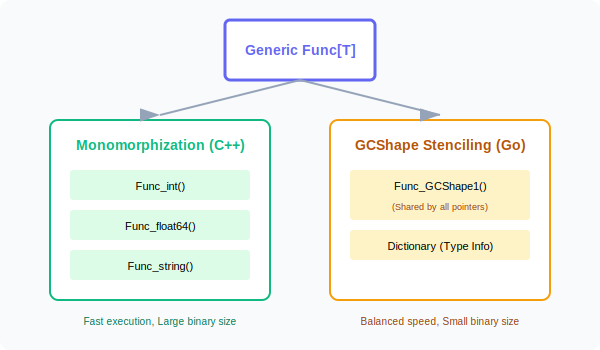

# CH-03: Under the Hood (Generics Internals)

> **"How Go handles generics is a masterpiece of compromise between compilation speed, execution speed, and binary size."**

---

## 1. Tahap 1: Source Alignments & Judul
- **Source Link**: [Go Design Doc: Generics Implementation](https://github.com/golang/proposal/blob/master/design/generics-implementation.md)
- **Status**: [x] Platinum Gold Standard

---

## 2. Tahap 2: Konsep & Esensi

### Definisi ("Apa itu?")
**Under the Hood** membahas mekanisme internal compiler Go saat menangani Generics. Go tidak hanya sekadar melakukan "Copy-Paste" kode untuk tipe berbeda, tetapi menggunakan teknik hibrida yang disebut **GCShape Stenciling** dengan **Dictionaries**.

### Rasionalitas ("Why & How?")
- **The Problem**: Bahasa seperti C++ menggunakan *Monomorphization* (membuat salinan fungsi untuk setiap tipe baru). Ini sangat cepat, tapi membuat ukuran file biner membengkak (*Binary Bloat*). Java menggunakan *Type Erasure*, yang hemat memori tapi lambat karena casting runtime.
- **The Go Solution**: Go mencoba mengambil jalan tengah. Compiler mengelompokkan tipe-tipe yang memiliki bentuk memori yang sama (misal: semua tipe pointer) ke dalam satu **GCShape**.
- **Efficiency**: Dengan GCShape, satu kode biner bisa digunakan bersama oleh banyak tipe pointer, sehingga menghemat ukuran biner namun tetap mempertahankan performa yang kompetitif.

### Analogi Model Mental
**Satu Ukuran untuk Banyak Orang**.
- Monomorphization: Anda menjahit baju khusus untuk setiap orang (Sangat pas, tapi butuh banyak ruang lemari).
- GCShape Stenciling: Anda membuat baju ukuran "Large" yang bisa dipakai oleh siapa saja yang badannya mirip (Cukup efisien, hemat ruang, tapi butuh sedikit penyesuaian/Dictionary di tempat).

### Terminologi Teknis
- **Monomorphization**: Pembuatan kode khusus per tipe data.
- **GCShape**: Pengelompokan tipe berdasarkan bagaimana Garbage Collector (GC) melihatnya di memori.
- **Dictionary**: Tabel tambahan yang dikirimkan ke fungsi generic untuk memberi tahu detail tipe aslinya saat runtime.

---

## 3. Tahap 3: Visualisasi Sistem

### Compilation Strategy Comparison

---

## 4. Tahap 4: Mekanisme Pembuktian (Generic vs Interface Performance)

Kapan Generics lebih cepat daripada Interfaces?
- **No Dynamic Dispatch**: Generics menghilangkan kebutuhan pencarian method di `itab` (itab lookup) karena alamat fungsi sudah diketahui lebih awal atau melalui dictionary yang efisien.
- **Inlining**: Compiler Go lebih mudah melakukan *Inlining* (memasukkan isi fungsi langsung ke tempat pemanggilan) pada fungsi generic dibandingkan pemanggilan melalui interface.
- **Escape Analysis**: Generics seringkali membantu objek tetap berada di *Stack* daripada "kabur" (*escape*) ke *Heap*, yang secara drastis mengurangi beban Garbage Collector.

---

## 5. Tahap 5: Multi-file Lab Praktis (Examples)

Menguji batasan dan perilaku generics.

- **Lab 1**: [01_generic_limitations.go](./examples/01_generic_limitations.go) - Memahami apa yang TIDAK BISA dilakukan generics (misal: pemanggilan method non-interface).
- **Lab 2**: [02_dictionary_overhead.go](./examples/02_dictionary_overhead.go) - Diskusi konseptual mengenai kapan interface masih lebih baik.

---
*Status: [x] Complete (Gold Standard - PPM V4)*
